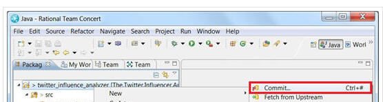

# Share code changes from Eclipse
You can update your application and then push those changes so that your teammates have them. 
The following instructions explain how to complete those tasks from Eclipse when you have your source
code in a Git repo hosted at JazzHub.

This procedure is more effective if you complete it with a partner, so the steps are divided between Partner A and Partner B.

## Make a change and check it in from Eclipse

Partner A completes these steps.

Application source code is contained in your JazzHub project. You must commit the code into Eclipse to edit it. 

1. In Eclipse, click **Window > Show View> Project Explorer**. 
2. In the Project Explorer view, double-click the hosted Git application to expand its contents. 
Double-click the **WebContent** folder. 
3. Select the **WEB-INF** folder. Right-click and select **New > File**. 
4. In the New File window, name your file and click Finish. 
>	
5. Edit your file and save it.
6. Select the project in the Project Explorer view.
7. Right-click and select **Team > Commit**. This backs up your changes in the local respository for the project. 
>	
8. If prompted, enter your Jazz user ID and email. 
9. When prompted, enter a commit message. 
>	
10. Right-click and select **Team > Push to Upstream**. This backs up the changes to the remote repository for the project. 
11. If prompted, enter your jazz.net credentials and click **OK**. 
12. Click **OK** again. The changes that you made should be in the repository. 
>	

## Accept your teammate’s changes from Eclipse

Partner B completes these steps.

1. In Eclipse, select **Window > Show View**. Click Project Explorer.
2. In the Project Explorer view, right-click the hosted Git application.
3. Select **Team > Pull**. 
4. In the Pull Result window, review the commits that were pulled and click OK. 
>	

You edited an application in a Git repo hosted on JazzHub, pushed, fetched and merged updates by using Eclipse.  

***
# Share code changes from the JazzHub Web IDE 
You can update your application and then push those changes so that your teammates have them. 
The following instructions explain how to complete those tasks from the Web IDE when you have your source
code in a Git repo hosted at JazzHub.

This procedure is more effective if you complete it with a partner, so the steps are divided between Partner A and Partner B. To add a teammember for this procedure, execute the steps in the Invite others to join your project section of this tutorial.

## Make a change and push it from the Web IDE

Partner A pushes changes to the repository by completing these steps.

1. If you are not currently in the JazzHub code editor, browse for your project at https://hub.jazz.net, open your project, and then click Edit Code for your project.
2. Open a file in your sample application code base and make a change to it that you can test when you deploy the application. For example, if you are using the Sentiment Analysis App code base, you have already made changes to manifest.yml and package.json while configuring your forked application.
3. In the Unstaged section, click the Stage icon.
>	
4. Your change is shown in the Staged section. Changes in this section are checked into your repository workspace and are backed up on the server; however, they are not delivered to the project stream for others on your team. Click COMMIT to commit the changes.
>	
5. In the commit message window, enter a comment to describe your changes and click **Submit**.
>	
Your change is shown in the Commits for "master" branch section. 
6. In the Commits for "master" branch section, click **PUSH** to push changes to the project stream for your teammates.
>	
    

## Access your teammate's changes from the Web IDE

Partner B updates their local repository by completing these steps.

1. If you are not in the JazzHub code editor, browse for your project at https://hub.jazz.net, 
open your project, and then click **Edit Code** for your project.
2. Click **Git status** to see changes from Partner A.
3. The changes from Partner A reside in the Commits for "master" branch section. Click FETCH to fetch the changes from the remote repository. Expand the Commits for "master" branch section to see what changes Partner A made.
>	
4. Click **MERGE** in the Commits for "master" branch section to bring in the updated files into your repository workspace.
>	
5. Return to the JazzHub code editor by clicking the pencil icon in the left navigation pane.
6. Go to the file that was updated by partner A and verify the changes.

You edited an application in a Git repo hosted on JazzHub, pushed, fetched and merged updates by using the Web IDE.