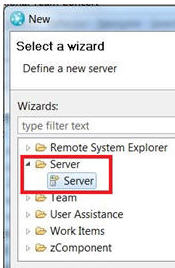
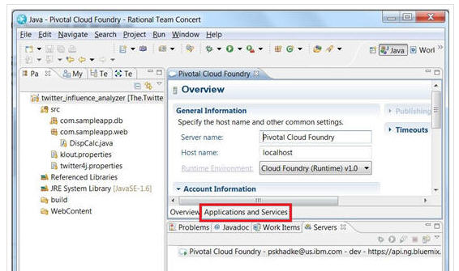
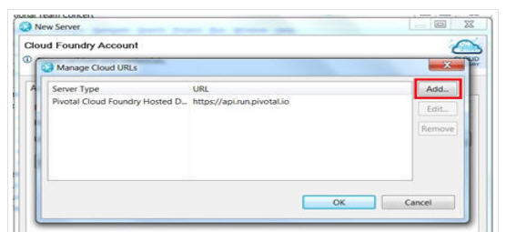
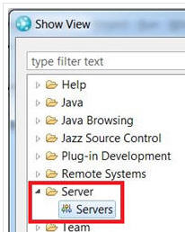
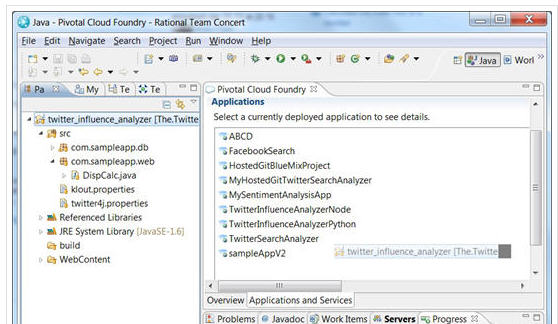
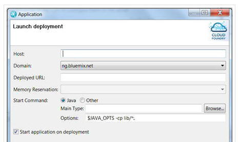
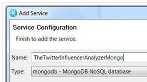
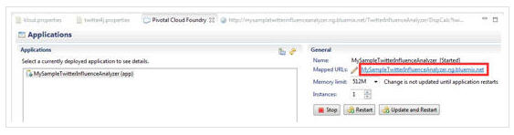

# Push changes to BlueMix from Eclipse 
So far you've forked and configured the [Twitter Influence Analyzer project](../Projects/forkproject), 
and now you are ready to
push that sample to BlueMix. Before you can push the app, you must connect to BlueMix.  

## Connect to BlueMix from Eclipse by using the Cloud Foundry plug-in #
You've [installed the Cloud Foundry Eclipse plug-in](../Setup/eclipseclient). Now you
can use that plug-in to connect to BlueMix. After you connect, 
you can open and manage your IBM BlueMix applications in Eclipse.

1. From Eclipse, click **File > New > Other**. 
2. On the Select a wizard page, click **Server > Server** and click **Next**.
>	
3. On the Define a New Server page, select **Pivotal > Cloud Foundry** and click **Next**. 
>	
4. On the Cloud Foundry Account page, enter your IBM ID (not your Jazz user ID) and password, and click **Manage Cloud**.
5. On the Manage Cloud URLs page, click Add.
>	
6. In the Add and validate a Cloud URL window, enter BlueMix as the name and https://api.ng.bluemix.net as the URL; then, click **Finish**. 
7. In the Manage Cloud URLs window, click **OK**.
8. On the Cloud Foundry Account page, select BlueMix as the URL, click **Validate Account**, then click **Finish**.

***
## Push your app to BlueMix
You've set up the server to connect to BlueMix. Now you can use that server to push your app changes to
BlueMix.

1. In Eclipse, open the **Servers* view by clicking **Window > Show view > Others**.
2. From **Show View** click **Servers**.
>	
3. Double-click the Pivotal Cloud Foundry server to open it. 
4. On the Overview page, click the **Applications and Services** tab.
>	
5. Drag your application from the Project Explorer view to the Applications section of the Pivotal Cloud Foundry view.
>	
6. In the Application window, enter a name for your application, a Buildpack URL if your application requires a build pack, and click **Next**. None of the sample Java applications require a build pack, but a build pack might be required if you are working with another sample. 
7. On the Launch deployment page, you can configure your deployment details. Click **Next**. 
>	
8. On the Services selection page, you can bind or add new services to your application. 
Some applications do not require services. The Twitter Influencer Analyzer (Java) application 
requires a MongoDB service, so you create one in this tutorial. 
	* Click **Add Service**.
	* In the Add Service window, enter a name for your service, select **mongodb** as the type, and click **Finish**.
>	
9. In the Application dialog box, click **Finish**. The Console view displays the details of the server startup. You know that the application was pushed successfully to IBM BlueMix when the console displays Server startup in x seconds.
10. To try your application, from the **Applications and Services** tab, in the General section, click the **Mapped URL** link. The Eclipse browser might not render all aspects of the sample application so you might want to use an external browser instead. 
>	

You pushed the Twitter Influence Analyzer (Java) app to BlueMix.

