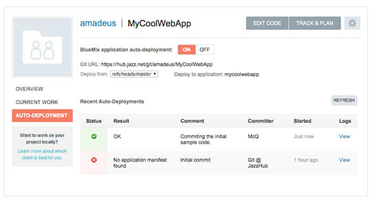
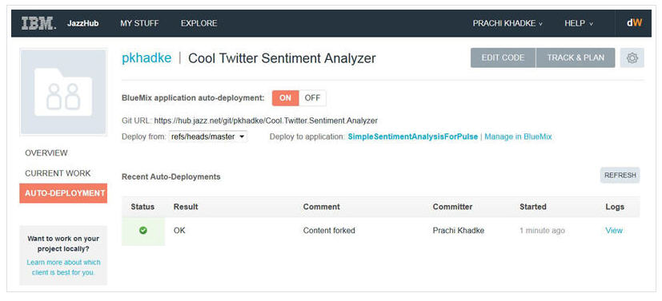
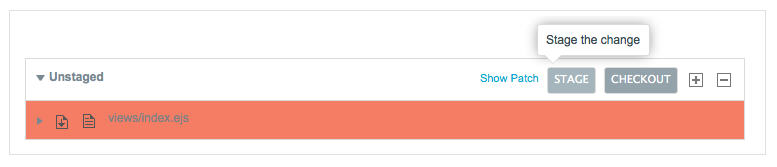
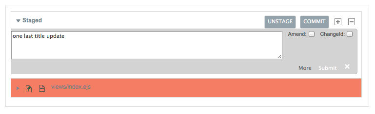
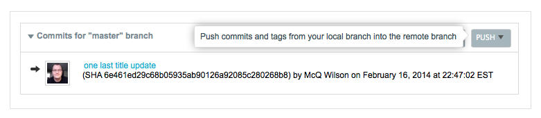
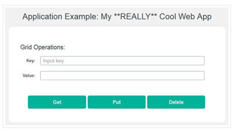

# Deploy to BlueMix 

You can auto-deploy app changes to BlueMix. Because BlueMix is based on CloudFoundry, it is also possible to 
manually deploy apps directly to BlueMix using the standard cf and gcf command line tools. Similarly, 
in the JazzHub web IDE, you can click **Deploy** to directly deploy whatever you are working on to BlueMix.

In both cases, this can be an effective way to work when you are doing rapid, solo development, 
but for many of you, the added security of having auto-deploy control of what is being pushed, 
is a better way to go. In essence, by using auto-deploy you always know that the code running in the application 
matches some known state in the repository, instead of whatever happened to be in your working directory at the time you pushed.

***
## Deploy automatically from the JazzHub auto-deployment page  

### Check the auto-deployment page for the BlueMix starter app 
You've just pushed the BlueMix starter app code to your Git hosted repo on JazzHub. 
When you created a JazzHub project you set auto-deployment on. 
Now, let's check the auto-deployment page, you see something like this image: 

>	

Notice that at the top of the recent auto-deployments list is an entry with a comment that matches 
the commit you did using the command line. That shows your app is now running the code you pushed.

If you're wondering about the **No application manifest found** entry on the auto-deployment page, 
that is because you turned on auto-deployment before you pushed any content into the repo. 
For auto-deployment to determine which application you want it to push to, it uses a file called manifest.yml. 
BlueMix provides that file in the download zip for the application, so once you pushed it to the repository, 
everything started working. 

So, now let's change your app source code and see what happens. And let's use the command line to do that.
Read on at [edit code with the Git command line](../Edit/editgitcmdline).  

### Turn on auto-deployment for the Sentiment Analysis app
So far you have pushed changes to your remote repo but you want to trigger a deployment automatically every time code gets pushed there. 
To set that up, you turn on auto-deployment. You do this by going to the AUTO-DEPLOYMENT tab on the project page 
and clicking the **ON** button. Clicking the **REFRESH** button shows you the status of your deployment in the Recent Auto-Deployments section. 
Upon successful deployment, a link to the deployed application is displayed beside the **Deploy to application** field on the page.

>	

## Push changes from the JazzHub editor  

### Push changes for the BlueMix starter app 
You've just made changes to your BlueMix starter app code by using the JazzHub editor. 
You can then use the integrated Git support to push the change.

You start by switching to the Git Status page.

>	

Where you can then stage

>	

commit

>	

and push the change 

>	

just like you did with the command line (only with a few more clicks and a lot less typing). 
And then, finally, you can see once again that your app was updated.

>	

If auto-deployment is on, your changes are automatically deployed to BlueMix.  

### Push changes for the JazzHub Sentiment analysis app
You've started your JazzHub app work by changing the sentiment analysis app and then forking that app to your
own JazzHub project.  You want to share your changes with other users of the project 
so let's push them from your local repo to the remote repo. 
First you go to the Git Status page in the code editor and stage the app.js file.

>	

Next, you click **COMMIT**, enter a commit message and click **Submit**. 
This backs up your changes to your local repository.

>	

Clicking **PUSH** pushes the changes to the remote project repo.

>	

But wait, how do you get your changes automatically deployed to BlueMix. You can use the JazzHub
auto-deployment feature. Read on at [Turn on auto-deployment for the Sentiment Analysis app](pushfromjh). 
 
## Deploy manually from the JazzHub editor  

