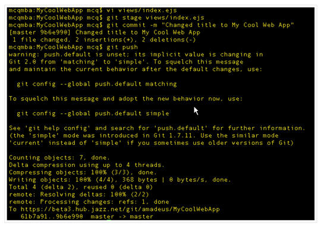
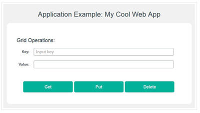

# Edit code with the Git command line

You started at BlueMix with a starter app and have loaded the app code into a Git hosted repo at JazzHub. You just finished checking
the [auto-deployment page at JazzHub to see how auto-deployment works]((../Deploy/pushfromjh#autodeploybluemixstarterapp).  
).
You now want to edit that code with the Git command line.
In the views folder there's a file called index.ejs. This file implements the main page from the example. 
If you change this file, for example, by modifying the title that is displayed, and then do another git push, like this image:
 
>	 

You can then go look at your running app and see that the title was updated (Hint: The title was Application Example: run DataCache using REST API):

>	 

Well there you go. Now you can continue to changes to the example and push them to the Git repo 
as often you want to. And as the scope of the work grows, and more people are added to the JazzHub project to work on it, 
everyone can push changes to the repository. Standard repository operations and auto-deploy are all that is required 
to ensure that the right bits are always running.

So far you've used command line tools to modify your code and push it to the repository, and you've seen that this works just fine. 
However, there is another way you can work with JazzHub. You can use the JazzHub editor. 
Lets do that at [edit code from the JazzHub editor](editjheditor).