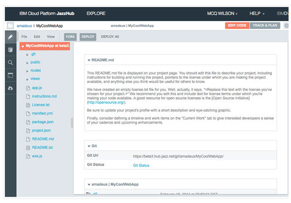
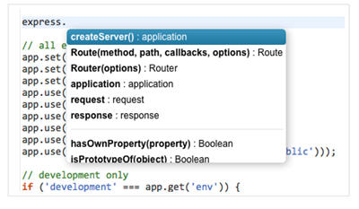
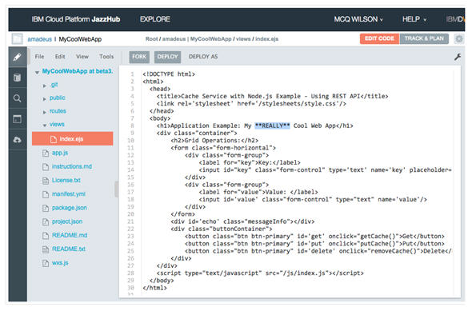
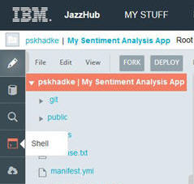
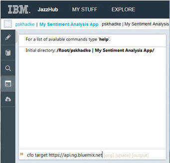
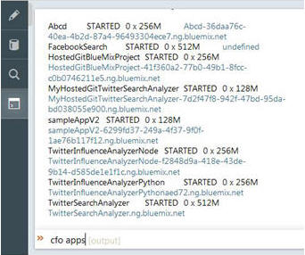

# Edit code from the JazzHub code editor

If you started at BlueMix with a starter app, you've used command line tools to modify your code 
and push it to the repository, but you can also use the JazzHub editor to change the code. 

If you go back to the JazzHub project page, you can see a button labelled **Edit Code**. 
Clicking this button, takes you to a complete online integrated development environment (IDE), 
based on the work of the Orion open source project. Here's what it looks like open for our example project:

>	 

From this environment, you can edit files with syntax coloring support for multiple languages including html, css, javascript, ruby, python and more. For some languages, such as JavaScript, the IDE also supports syntax checking and code completion, both for standard language constructs and for the services provided by BlueMix. 
For example, here's what it looks like providing completion for the standard node.js express module:

>	 

So just to round out the process, let's make one more modification to your application using the web IDE. 
You can navigate using the tree until you get to the same file you worked on before (for example, views/index.ejs), 
and then simply edit in place.

>	 

You can then use the integrated Git support to push the change. Read on at [push changes from the JazzHub editor](../Deploy/pushfromjh).

## Run Cloud Foundry commands from the Jazzhub editor shell

With the shell, you can run commands as you do from the command line. 
To use the shell from the JazzHub code editor, follow these steps:

1. To access the shell from the JazzHub code editor, click the Shell icon.
>	 
2. The first time that you use the shell, you must set the target to point to BlueMix. From a command line, type cfo target https://api.ng.bluemix.net and press Enter.
>	 
3. You might want to use the shell to execute a command like cfo apps so you can view a list of all your applications.
>	 
If you get the error "Error: Invalid Auth Token", login with your IBM ID and password before executing cfo target. The instruction to login is cfo login <IBM ID> <password>.
4. You can obtain a list of all of the Cloud Foundry commands by typing help cfo.
>	 

   

