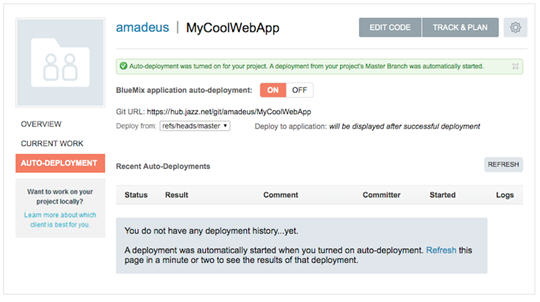
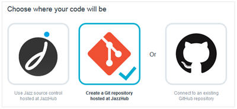
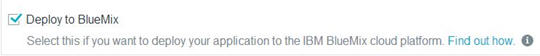

# Start coding in a new JazzHub project 

There are a lot of ways you can work with your application code, but one of the slickest is to use something called auto-deploy. 
Auto-deploy gives you the ability to modify the code that is running in your app by simply pushing the changes to a Git repository. 
The mechanism that implements auto-deploy is provided by JazzHub, so let's talk a bit more about that.

It turns out though that in addition to auto-deploy, JazzHub provides a lot of other capabilities that are useful for application development. 
Indeed, JazzHub is all about development with features like:

* Free public project hosting
* Multiple source code repositories
* Support for teams doing Agile development
* Web based development tools with customizations specifically for working with BlueMix
* and lots more coming...

If you want to know more about JazzHub, you can start by reading the information at http://hub.jazz.net, 
but since you're like us and prefer to try things rather than read about them, let's do something with JazzHub.

To start you must register at JazzHub. Take a look at [Register or sign in at JazzHub and BlueMix](../Setup/registerandsignin).
After registering or signing in, you always end up at the JazzHub My Stuff page. From there, you can click **CREATE PROJECT** and fill in the details. 
Most of it is a personal choice, but there are are two important options. The first is the repo to use to manage your source code and the second is the option to deploy your app to BlueMix. 

JazzHub provides hosted Jazz SCM and Git repos and also lets you connect to an existing GitHub repo. If you choose hosted Git and you plan on using the Git command line or another Git client, you’ll need the Git Repository URL. The repository URL is shown on this page and is also  available later on your project’s pages.
Or, if you have source code in a project at GitHub, you can choose GitHub as an option and specify the URL to your GitHub repository.

In addition to enabling auto-deploy for the project, choosing the option to deploy to BlueMix configures the project with other capabilities that are useful for BlueMix development — more about that later.
 
Once the project is created, you are taken to the new project's home page. There is lots of useful information on this page, but since you want to work with the code for your app, the most important information is the **AUTO-DEPLOYMENT** tab in the left-hand pane. Clicking that tab opens a page that lets you configure (and see the status of) auto-deployment from this project.

Basically, all you do is change the switch to **ON**. Once auto-deployment is on, a dialog prompts you for your BlueMix credentials, so JazzHub can verify that it can push code on your behalf. After that, the page switches to something like this image:

>	

Notice the Git URL field. That is the URL that you are going to use with your Git commands. 
You can copy it now, or come back to this page later.

***
## Create a JazzHub project and add code from a BlueMix starter app

You've just come from [BlueMix where you added a simple Node.JS web server app](starterapp) and ran that app in BlueMix. Since you want to modify the app, your
next step is to create a JazzHub project to hold the app code. 

[Read about JazzHub projects and how to create one](#startcodinginaproject) in the previous section, but be sure to choose a Git hosted repo 

>	

and the option to deploy the app to BlueMix.

>	

Now it’s time to add the starter code into the project. 
You have a couple of choices. You can click **Edit Code** and select from the **File** menu to import individual files or *.zip files. 
Or you can use the Git command line to load your repo. 
[Let's use the command line](#loadrepoforbluemixstarter]. 

### Load your repo with the starter app code by using the Git command line (clone, unzip, push)

So, now you have a repository (also known as a JazzHub project) to hold your code, and a zip file to put in it. Lots of tools can be used to work with Git, including all of the major desktop IDEs and even directly from the web using the JazzHub IDE (which we'll talk about later) but for now let's just use the command line Git support.

First you clone the repository using the URL from the JazzHub auto-deploy page

	git clone https://hub.jazz.net/git/amadeus/MyCoolWebApp

Then you unzip the contents of the zip file into that directory

	unzip  /Users/mcq/downloads/mycoolwebapp.zip

And finally you apply some standard Git magic to push the contents into the repository at JazzHub. First commit the changes to the local clone.

	git add *

	git commit -m "Committing the initial sample code"

And then push them to the remote repository. If you get prompted for your credentials, just enter your Jazz User ID and password.

	git push
	
Now, this is where it starts to get interesting! If you go back to JazzHub and check the auto-deployment page, you'll see the results
of your commit and a message about a missing manifest file. So lets go and check that out at [push changes automatically from the JazzHub auto-deployment page](../Deploy/pushfromjh#autodeploybluemixstarterapp).  
