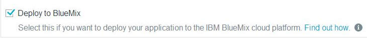

# Start coding in a new JazzHub project 

There are a lot of ways you can work with your application code, but one of the slickest is to use something called auto-deploy. 
Auto-deploy gives you the ability to modify the code that is running in your app by simply pushing the changes to a Git repository. 
The mechanism that implements auto-deploy is provided by JazzHub, so let's talk a bit more about that.

It turns out though that in addition to auto-deploy, JazzHub provides a lot of other capabilities that are useful for application development. 
Indeed, JazzHub is all about development with features like:

* Free public project hosting
* Multiple source code repositories
* Support for teams doing Agile development
* Web based development tools with customizations specifically for working with BlueMix
* and lots more coming...

If you want to know more about JazzHub, you can start by checking out the information here, but just as you did with BlueMix, let's do something with JazzHub.

To start you must register at JazzHub. There is lots of information about registering and signing in here. (Register and sign in article link)

After registration or signing in, you always end up at the JazzHub My Stuff page. From there, you can click **CREATE PROJECT** and fill in the details. 
Most of it is a personal choice, but there are are two important options. The first is the repo to use to manage your source code and the second is the option to deploy your app to BlueMix. 

JazzHub provides hosted Jazz SCM and Git repos and also allows you to connect to an existing GitHub repo. If you choose hosted Git and you plan on using the Git command line or another Git client, you’ll need the Git Repository URL. The repository URL is shown on this page and is also  available later on your project’s pages.
Or, if you have source code in a project at GitHub, you can choose GitHub as an option and specify the URL to your GitHub repository.

In addition to enabling auto-deploy for the project, choosing the option to deploy to BlueMix configures the project with other capabilities that are useful for BlueMix development — more about that later.
 
Once the project is created, you are taken to the new project's home page. There is lots of useful information on this page, but since you want to work with the code for your app, the most important information is the **AUTO-DEPLOYMENT** tab in the left-hand pane. Clicking that tab opens a page that lets you configure (and see the status of) auto-deployment from this project.

Basically, all you do is change the switch to **ON**. Once auto-deployment is on, a dialog prompts you for your BlueMix credentials, so JazzHub can verify that it can push code on your behalf. After that, the page switches to something like this image:

>	

Notice the Git URL field. That is the URL that you are going to use with your Git commands. You can copy it now, or come back to this page later, but either way you are ready to load your repository with the code for the app, so let's go get it.

Now it’s time to get code into the project. Click  Edit Code. Select File>Import to import individual files or *.zip compressions. 

Or you can load the repo of starter app code by using the Git command line (clone, unzip, push). Lets use the command line.

## Create a JazzHub project and add code from a BlueMix starter app

You've just come from BlueMix where you added a a simple Node.JS web server app and ran that app in BlueMix. Since you want to modify the app, your
next step is to create a JazzHub project to hold the app code. 

Complete the steps above to create your project but be sure to choose a Git hosted repo 

>	

and the option to deploy the app to BlueMix.

>	

## Create a JazzHub project and add code with Eclipse

* Create an application manifest
* Connect RTC with the Git repo hosted at JazzHub

* Next steps
* Update the app Make a change and push it Accept a teammate's change
* Connect to BlueMix using the Cloud Foundry plug-in
* Push the app to BlueMix

## Create a JazzHub project and add code with the JazzHub editor

* Create an application manifest
* Update the app

* Next steps:
* Push the app to BlueMix from the JazzHub editor
* Push the app to BlueMix from the JazzHub auto-deployment page

