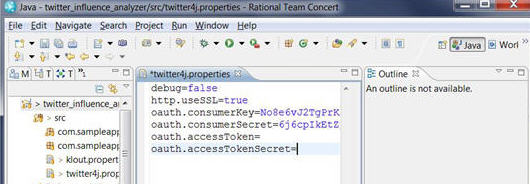

# Fork code from a JazzHub project 
It's easy to get started quickly to create your app from JazzHub by forking an existing JazzHub project. 
Both the Sentiment Analysis (node.js) and Twitter Influence Analyzer (Java) are JazzHub projects hosted in a
Git repo on JazzHub and are configured to push to BlueMix in that you don't need to learn how to 
write a manifest file. So what is a manifest and why is it necessary? 
A manifest file contains important settings such as the application instance name to use, the host machine, 
the services that the application utilizes and more. 
Deployment of a Jazzhub project from the Web IDE requires the project to have a manifest.yml file. 
This is because for auto-deployment to determine which application you want it to push to, it uses the information in 
the manifest file.

If you haven't already done so, the first step before you fork is to register. 
Take a look at [Register or sign in at JazzHub and BlueMix](../Setup/registerandsignin).

And by the way only one person on a team needs to fork the JazzHub project.
***
## Fork code from Sentiment Analysis (node.js) with JazzHub

### Start with the sample app
Before you fork the [Sentiment Analysis App](https://hub.jazz.net/project/spirit/Sentiment%20Analysis%20App/overview) app,
you might want to look at it first. Let's do that. You can see that this sample is a hosted Git project 
and that it contains the manifest.yml file for deployment. Let's suppose that you want to customize
the sample app. That's easy. Clicking **Edit Code** opens the JazzHub code editor 
where you can load the app.js file. Now change the app name on lines 87 and 124. 
Notice that the editor recognizes the file as a Javascript file and highlights everything for you.

>	

After changing the name, you can deploy the application to BlueMix and see your change. 
To deploy the application, you click **DEPLOY**. 

>	

You then check the deployment status shown in the Manual Deployment Information section. 
The status is green, so your deployment was successful.

>	

To see your change, you click the application link, which shows your running app.

>	

### Fork the sample application
Instead of working off a shared code-base, you can fork this code into your own project and 
use it as a starting point for your next application. You fork this code by clicking **FORK** and enter a name 
You get a new project, a new project name, and a copy of the code from the sample project.

>	

Now you can edit app.js in your own project, deploy the changes and see them go live. 
You can manage the live application instance from BlueMix. 
The **Applications** tab on the BlueMix Dashboard has the options to start, stop and delete the application. 
The **Services** tab has options to add various services such as mongodb, SSO, MapReduce and more.

After making changes, you'll want to share them with other users of the project 
so let's push them to the repository. Read how to at [Push changes for the JazzHub Sentiment analysis app](../Deploy/pushfromjh).

***
## Fork code from Twitter Influence Analyzer (Java) with Eclipse and JazzHub
Ready to create an app from a Java sample app, then fork the Twitter Influence Analyzer sample app.

1. Open the [Twitter Influencer Analyzer (Java)](https://hub.jazz.net/project/jstart/Twitter%20Influencer%20Analyzer%20%28Java%29/code) sample application on JazzHub. 
2. If you have worked with this sample application before, then you have a copy of it in your local repository. 
To make sure that you have the latest code updates to this sample application in your local repository, 
you must do these steps before you fork the sample. 
    * Click Git Status from the JazzHub code editor to see the base code changes.
	* Click **FETCH** to get these changes from the remote repository. 
	* Click **MERGE** to bring in the updated files into your local repository.
	* Click the pencil icon to return to the JazzHub code editor.
3. From the Web IDE menu, click **Fork** to bring the code into a new project. 
>	
4. In the Fork window, enter a name for your project and then save it. 
>	 

Next you want to set up your development environment so that you can use Eclipse to work with the sample code.  
Read how to do that at [Connect to your JazzHub project with EGit](../Setup/eclipseclient).

If you have set up your development environment, you are ready to configure the sample project. 

### Configure the sample project
The code base that you are using might require configuration changes or other edits. Browse 
the README.md file of the sample project to see notes about what if anything what must be configured. 

>	

The Twitter Influence Analyzer (Java) requires an update to the klout.properties and twitter4j.properties files, 
which are located in the src directory.
>	
>	

Now you're ready to push the sample app to BlueMix. Let's do that. Read how to at [push changes to BlueMix from Eclipse(../Deploy/pushfromelipse). 
 

