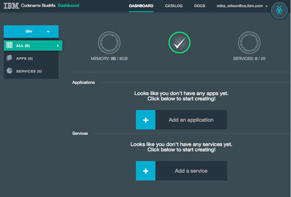
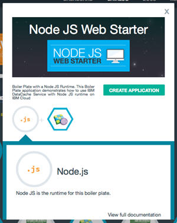
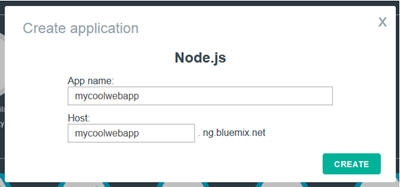
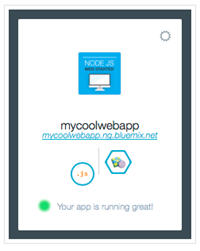
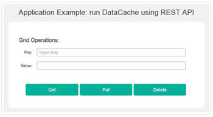
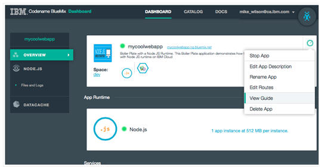

# Start coding with a BlueMix starter app
Codename BlueMix is an open-standards, cloud-based platform for building, 
managing and running apps of all types (web, mobile, big data, new smart devices). 
Capabilities include Java, mobile backend development, application monitoring, 
as well as capabilities from ecosystem partners and open source, 
all through an as-a-service model in the cloud.

If you haven't already done so, the first step to use these capabilities is to register. 
Take a look at [Register or sign in at JazzHub and BlueMix](../Setup/registerandsignin).

Once you've registered, there is lots of helpful information available on the Codename BlueMix site, such as

* Getting Started with BlueMix
* BlueMix Overview
-and a range of Tutorials

but if you're like us and prefer to try things rather than read about them, just follow along 
while we build a new app.

## Create an app from a NodeJS Web Starter Boilerplate

You can start by signing in to Codename BlueMix, which takes you to the Dashboard:

>	

Clicking **Add an application** lets you choose different kinds of runtimes (like Java or Ruby), 
services (such as DataCache or Mongo) and boilerplates, which are essentially pre-configured application templates 
that are great ways to get started. Let's select the Node JS Web Starter Boilerplate, 
which opens a panel that displays more information about what it does:

>	

As you can see, the application is a simple Node.JS web server that includes some example code that 
demonstrates the IBM DataCache Service. Let's try it! 

At this point, you are just two clicks away from having a running application:

1. Click **CREATE APPLICATION**
2. In the Create application window, fill in the **App name** and **Host** fields, and click **CREATE**.

>	

The **App name** is a simple name you can use to find this application the next time you come back to the 
dashboard. **Host** defines the URL that let's you access your new app from the Internet. 
(As you probably guessed this URL must be unique.)

That's all there is to it! It takes a short while for the application to start up, but once it does a 
tile on the dashboard shows it running.

>	

When you click the URL on the tile, it takes you to your already Internet visible, running application.

>	

Cool!

But wait, it's great that the application is running, but it's not very useful if you can't see the code 
(and modify it), so let's get ready to do that.

## Download the starter app

If you go back to your Codename BlueMix Dashboard, and click the tile for the application that you built, it takes you to a page that is specific to that application. There is a gear icon in the right pane of your app; if you click that icon, a menu opens with (among other things) a link called **View Guide**.

>	

This guide shows simple ways to interact with the app directly on BlueMix, but since you're going to use auto-deploy to work with the code, the part you care about is the link labelled **Download the starter application package**. Clicking that link gives you a zip of the code for your application.

Ok, you've got a zip of the app code, but where can you store that code so you can work with it. You're ready
to create a repo and a JazzHub project provides that. 
Do that at [create a project for a bluemix app](createproject). 
