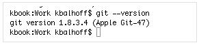
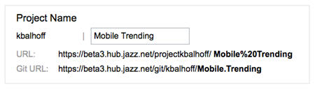
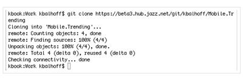
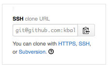
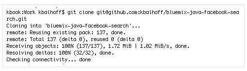

# Connect with a command line #

## Working with Git (hosted by JazzHub or GitHub) 

In addition to the following information, you might want to look at the 
[Coding with Eclipse plug-ins](eclipseclient) if you are working with Eclipse and Git.

### Install Git

1. Check to see if Git is already installed. Open a Terminal and enter: git --version. 
If Git is installed, the command returns with your version. 
>	
2. If Git is not installed, download and install the version for your platform from [Git](http://git-scm.com/downloads). 
>	

### Connect to a Git project hosted on JazzHub

1.Find the URL to clone your Git repository to your local computer by using one of the following ways:
* If you create a project on JazzHub with the option to create a Git repository hosted at JazzHub, you can copy the Git Repository URL from the Create a project page. 
>	
* Find the Git Repository URL on your project page from the **Git URL** link.
>	 
* Find the Git Repository URL from the **Settings** tab on your Project page 
>	
2. Open a Terminal. Change to the directory where you want to put the code from your JazzHub Git project. Enter git clone and paste in the repository URL. The result should look similar to this 
>	
3. Now you have a local copy of the code for your project. Browse http://git-scm.com/doc to learn more about working with Git. 

### Connect to a Git project hosted on GitHub

1. Find the URL to clone your Git repository to your local computer. View your project page on GitHub and find the URL to clone through your choice of HTTPS or SSH. Copy the URL. 
>	
2. Open a Terminal. Change to the directory where you want to put the code from your GitHub project. Enter “git clone” and paste in the URL from GitHub. If this is the first time you have connected to GitHub with the SSH clone URL, you are prompted to validate your key. Once that’s complete, try the clone command again. The result should look similar to this image: 
>	
3. Now you have a local copy of the code for your project. Browse http://git-scm.com/doc to learn more about working with Git. 

****

## Working with Jazz SCM 

****

## Working with Cloud Foundry ##