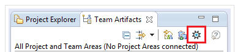
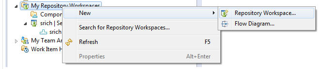

# Code with Eclipse plug-ins 
You can connect to your JazzHub projects from your Eclipse development environment to work on project plans, 
track work items, and develop code. 
Take a look at this list of Eclipse plug-ins, and decide which tools can help you get the most out of JazzHub: 

* Rational Team Concert
* Cloud Foundry
* EGit

## Rational Team Concert

JazzHub is built on Rational Team Concert, so this is a great place to start if you want to edit code locally 
on your desktop. If you have the Rational Team Concert client, skip ahead to [connect to your JazzHub project](eclipseclient#connectRTC) 
from within the client. If you don't have the Rational Team Concert client yet, 
you can install Rational Team Concert as a plug-in for Eclipse. 
In the next steps, you'll get the required version of Eclipse and install the plug-in. 

### Install Eclipse and the Rational Team Concert plug-in

1. Rational Team Concert requires Eclipse 4.2.2. If you don't have Eclipse 4.2.2, download and install Eclipse 4.2.2 from [Eclipse.org](http://eclipse.org).
2. In Eclipse, go to **Help > Install New Software** 
>	
3. In the Install page:
	* Enter the update site in the Work with field: https://jazz.net/downloads/rational-team-concert/4.0.6/4.0.6/p2 and press Enter to load the contents of the update site. 
	* Select the **Rational Team Concert Client Feature** check box. Select the **Group items by category** check box.
>	
4. Click **Next** and accept the license terms, then click **Finish** to install the plug-in. 
Installing the RTC plug-in can take several minutes. 
5. If you see a warning that you are installing software that contains unsigned content, that is expected. 
Click **OK** to continue.
>	
6. Restart Eclipse for the changes to take effect.

### Connect to your JazzHub project from Eclipse
You've set up a JazzHub project and you want to connect that project to Rational Team Concert.

1. In Eclipse, go to **Window > Show View > Team Artifacts**. Click the JazzHub icon.
>	
2. In the Manage JazzHub Projects window, enter your Jazz User ID and password for authentication to JazzHub.
>	
3. Click **Next**. Then select the JazzHub projects you want to connect to and click **Finish**.
>	
4. Click the **Team Artifacts** tab and see the new Repository Connection and Project Area.
>	

#### Load code into Eclipse from Jazz SCM
If your project is in a Jazz SCM repository, follow these steps to load your code into Eclipse. 

1. Create a repo workspace. Go to **My Repository Workspaces**, right-click, and select **New > Repository Workspace**.
>	
2. Select the stream you want to flow to. Click **Next**.
>	
3. 3.Specify a new name for your repo workspace. Click **Finish**.
>	
4. The Load Repository workspace page opens. 
Choose to find and load Eclipse projects to load all of the projects from the components in your 
repo workspace. This loads the code into your local Eclipse workspace. 
>	
5. Select the Eclipse projects to load into your local Eclipse workspace. Click **Finish**.
>	

You have created a repo workspace and loaded code. 
>	

Now you can browse the loaded files, open a file, and edit code. 
>	

## Cloud Foundry Eclipse plug-in
You use the Cloud Foundry Eclipse plug-in to connect to Codename BlueMix.
1. In Eclipse, click **Help > Eclipse Marketplace**. 
2. In the Eclipse Marketplace window, in the **Find** field, 
enter Cloud Foundry Integration for Eclipse, and click the search icon.
>	
3. After the results are displayed, in the section for Cloud Foundry Integration for Eclipse 1.5.1, click **Install**.
>	
4. On the Confirm Selected Features page, clear the **GoPivotal, Inc. UAA Integration (optional)** check box 
and click **Confirm**.
>	
5. When you are prompted, accept the terms and click **Finish**.
6. If you are prompted to restart Eclipse, click **Yes**.

## EGit Eclipse plug-in
You use EGit to work with Rational Team Concert and a Git repo hosted on JazzHubhosted Git projects.

### Install EGit
1. Before installing EGit, check to see if it is already installed. 
In Eclipse, go to **Window > Show View > Other** and enter git as the filter text. 
2. If you see views similar to the following list of git tools, 
skip ahead to Connecting to your JazzHub Project with EGit.
>	
3. In Eclipse, click **Help > Install New Software**. 
4. In the Install window, complete the following steps: 
	* In the Work with field, enter http://download.eclipse.org/egit/updates, and click **Add**.
	* Select the **Eclipse Git Team Provider** check box.
	* Click **Next**. 
	>	
5. Click **Next** to complete the steps in the wizard.
6. When you are prompted, accept the terms and click **Finish**.
7.If you receive a security warning message, click **OK**.
8.If you are prompted to restart Eclipse, click **Yes**.

### Connect to your JazzHub Project with EGit
After your project is set up, 
you can copy the Git URL so that you can connect Rational Team Concert with your hosted Git repository. 

1. Go to https://hub.jazz.net and log in.
2. From the list in the View field, select **All My Projects**.
3. Click the link to open the project details page for your project.
4. In the Code section, click the Git URL link and copy the text in the Git URL box.
>	
5. In Eclipse, use the Import wizard to load your Git repo. Use **File > Import** from Eclipse. Click **Next** to page
through the Import wizard.
	* Select your Git project source to import.
>	
	* Select the Git repo URI.
>	
	* Paste the copied Git URL in the URI field. Also enter your Jazz.net User ID and password in the Authentication section.    
>	
	* Update the Local Destination of the cloned repository if needed. 
>	
	* Click **Next** and then **Finish**.