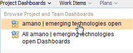
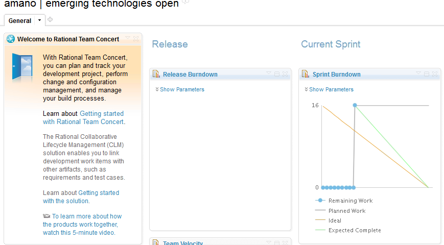
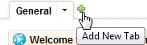
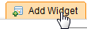
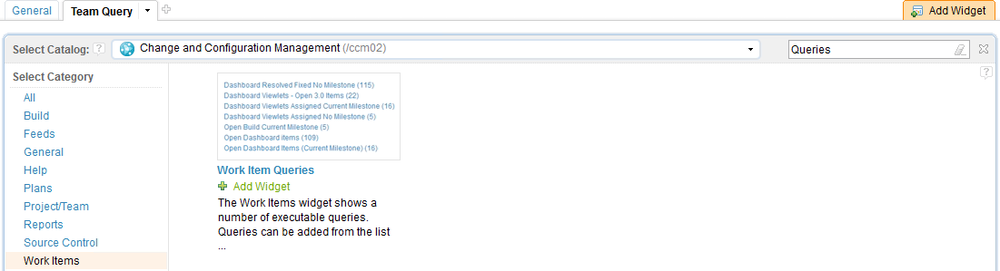
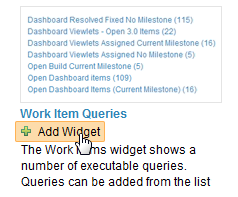
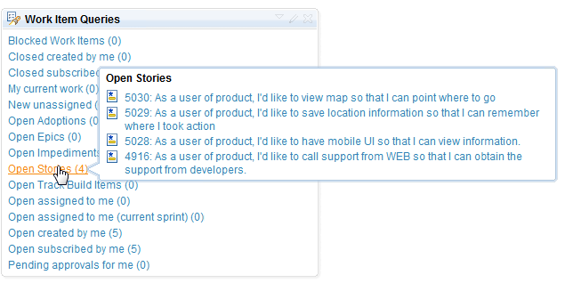
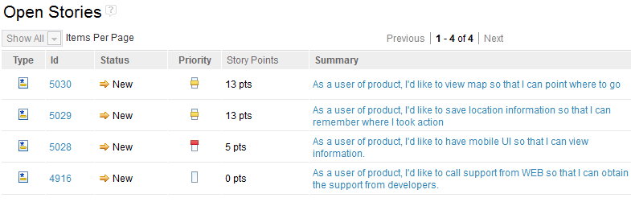

## Team Dashboard

Team dashboard displays what's going on in the projects. 
The team dashbaord also provides the following display to assist
Agile development.

* Release and iteration burndown chart
* Team Velocity
* Impediments (based on query)

At the project creation, JazzHub provides default dashboard.

### View the default dashboard.

1. Click "TRACK&PLAN" button (if you are not this mode).
2. Click "Project Dashbaords" and select your project dashboard.
>  

Note that the figure is selecting a project for this tutorial.

>  

### Add tab and widget to the dashboard.

1. Click "+" icon next to "General" tab
>  
2. Click "Add Widget" button
>  
3. Select "Work Items" in the category and search by "Queries"
>  
4. Add "Work Item Queries"
>  
5. Click close button to close widget selection menu.

Now you will see several queries provided by default.

>  

Try to run several queries. For example "Open Stoties"
query will show like this example.

>  

