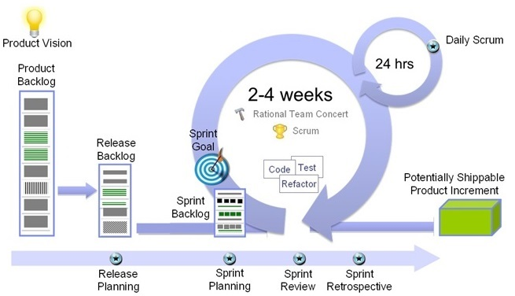
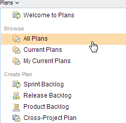
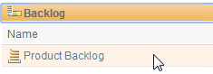
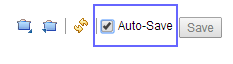
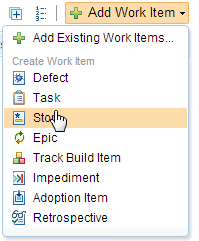
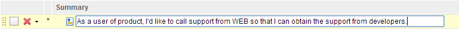
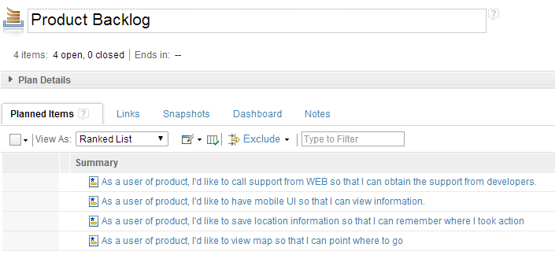

# Create a product backlog

In Agile development, software features or technical debts are tracked as backlog.
You may have notice that there are four categories in the plan. They are

* Iteration backlog
* Release backlog
* Product backlog
* Cross-project Plan

The figure shows how these backlog are handled in the Agile development process.

> 

In this section. You will create product backlog for the project using JazzHub planning capability.

## Manage Product backlog

Product backlog is created by JazzHub project creation by default. To open the backlog,
follow the steps below.

1. Click "TRACK&PLAN" icon.
> 

2. Select "Plans" -> "ALl Plans" menu
> 

3. Click "Product Backlog"
> 

As you may notice, the plan editor is probably empty. For ease of use of
this tutorial. Check "Auto-Save" checkbox botton. This will enable to
save when you edit the plan.

> 

## Create product backlog

To create product backlog, you will create so called "work item". There are several work item 
types such as Epic, Story, Task, Defect, so on. For the product backlog, story or epic work 
item type is probably sufficient. To add work items, follow the steps below.

1. Click "Add Work Item" button. For this tutorial, select "Story".
> 

2. Add summary for this work item.
> 

3. Add more work items.
> 

Now, you have several product backlogs. Go back to project top page, and select 
"CURRENT WORK". You will notice that the work items created are displayed in the
project top pages now.

