## Create release and iteration plan using JazzHub

So far you have created Product backlog. These backlogs are not nessesary
going to be included in the software. For example, stakeholders may have
input several feature requests. However, at some point, the features
may not be relevant to the market at all. 

The candidates of features are managed in the release backlog, and
make priorities accoding to the needs of stakeholders. Here you
will learn how to create release backlog and make priorities. 

Higher priority features will be a candidate of interation plan.
You will learn how to create iteration plan too.

### Create a release backlog

When you have new JazzHub project, there is only plan called "Product Backlog". 
You need to create Release backlog to manage release backlog. To create
a release backlog, follow the steps below:

1. Click "TRACK & PLAN" button (if you are not in this mode).
2. Select "Plan" -> "Release Backlog" menu
>  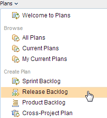
3. Enter the name of Plan (e.g. Release Plan)
>  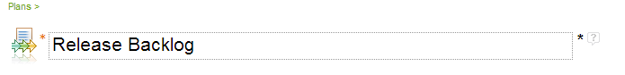
4. Click "Owner" button. Select your project name.
>  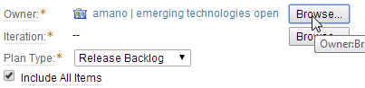
5. Click "Iteration" button, and then select "Release".
>  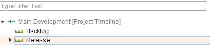
6. Make sure the plan type is release, and the save the plan.

Now, you have created the release plan. Since you have not yet decided 
which stories should be included, the plan is empty. In the next section,
you will fill stories and assign priorities.

### Select stories to be included in the release

1. Open the product backlog plan. And select several candiate stories.
>  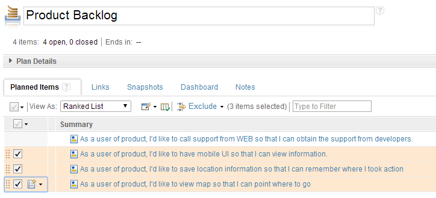
2. Open the menu to move the selected stories to release backlog.
>  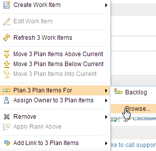
3. Select "Release" as a target.
>  
4. Save the product backlog.

At this time, un-selected stories will remain as product backlog, and 
selected stories are moved to release backlog.

### Priorities the stories and assign story points and plan the release.

Depending on situation, the priority and story point may be assigned at the 
time of product backlog. But in this tutorial, these are set in the release
backlog. Note handle priority and story point according to your Agile 
practice. 

1. In the plan view (e.g Release Backlog), change the View As: to "Ranked List"
>  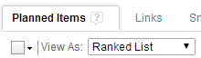
2. Set the story point
>  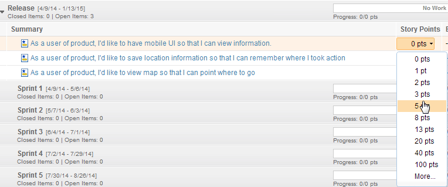
3. Set the priority
>  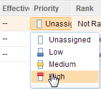
4. Go back to "Iterations" View
5. Drag and drop high priority stories to Sprint1
>  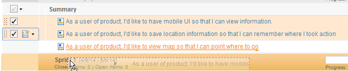
6. Drag and drop rest of stories to Sprint2

### Create a iteration plan.

You have created a release plan, and stories are moved to iteration.
Depending on the size of the project, the release plan may become
large to manage. JazzHub offer "Sprint backlog" so that each iteration
can be managed and tracked more easily. 

1. Click "Plans"->"Sprint Backlog" menu
>  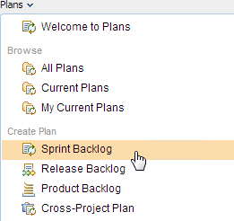
2. Name the plan e.g. "Sprint 1 Backlog"
3. Select owner and also set the target iteration.
>  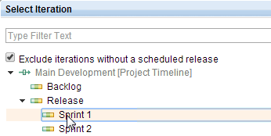

Now, the iteration plan will looks like this.

>  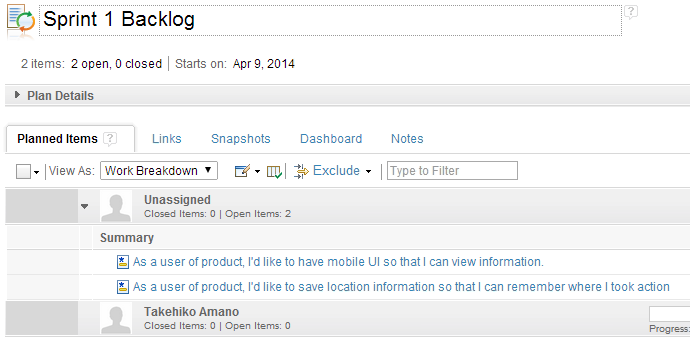

You have created a sprint backlog. Now the team can start to work
based on agreed plan.

