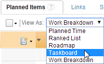
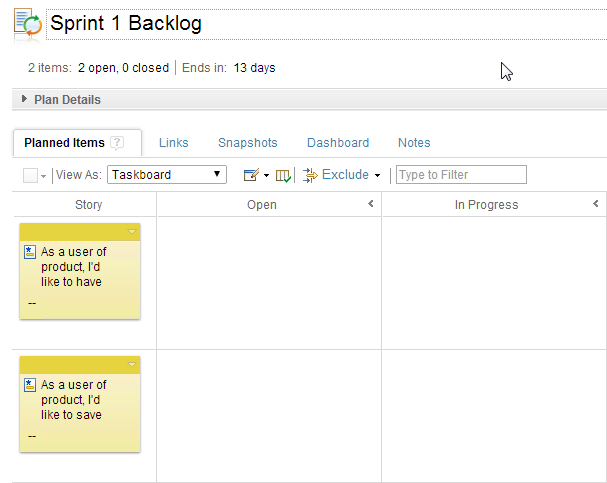
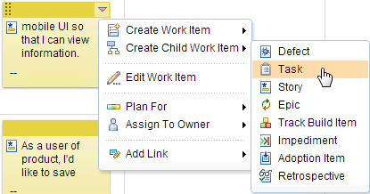
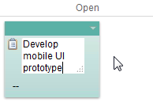
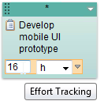
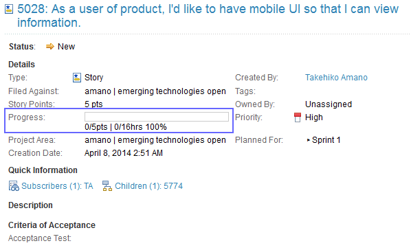
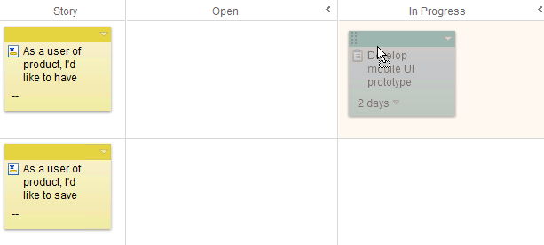

## Working on Iteration Plan

Once the Iteration plan has been created, the team member pick up story
and create relevant tasks associated with the story. In this tutorial,
you will learn how to create tasks associated with Story, and start to 
working on a task.

### Change iteration view to Task Board

During the sprint, the team member work on stories to acomplish 
sprint goal. Agile product often use task board. Each developer
pick up story or task card, and put the card to "In Progress".

JazzHub provides electric task board. This task board can be
shared even in a geophysically distributed team.

To learn how to work on sprint using Task board, follow the step
below.

1. Open the sprint backlog.
2. Change "View As:" to "Task Board".
>  

JazzHub shows stories at the left hand side of board.

>  

### Pick up story and create tasks for a story.

Each developer pick up the story, and then create associated
tasks to complete the story. Here is how to create tasks under each story.

1. Select one of the story and select menu "Create Child Work Item"
>  
2. Enter summary of the task.
>  
3. Optionally, you may enter estimate of effort to complete the task.
>  
4. Save the plan by clicking "Save" button.

If you check the story, it will open workitem mini window.
You may notice that effort is equivalent to which you entered at the
task. 

>  

JazzHub sums up efforts to complete the task in the parent work item (Story in this case).

### Move to "In Progress" and "Close" status.

You can use this task board to change the status of task into "In Progress". 
To do this, just drag and drop the work item.

1. Select a task and move into "In Progress"
>  

Now, you are ready to work on a task in "In Progress" state.

