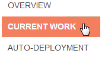
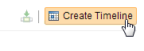
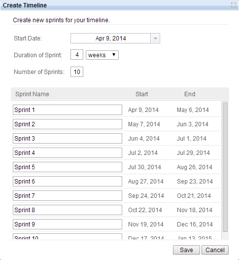
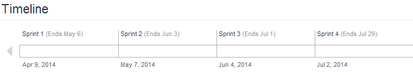
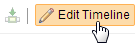

# Create a timeline of JazzHub Project

A timeline represents an area of activity within a project that typically has its 
own schedule. Project intervals or phases are defined within a timeline and expressed 
as iterations. Each iteration defines its own start and end dates.

## Create a timeline.

[Note] for international users. If you have problem to follow the steps. Change the browser 
language setting to use English. Currently, this problem is tracked as defect.

To create a timeline. Follow the steps below.

1. Click "CURRENT WORK" at project top page
>  
2. Click "Create Timeline" link
>  
3. Enter start date, duration of print and number of Sprints.
>  

Once the timeline is created, the timeline will be shown at the project top page.

> 

## Modify a timeline.

If you want to add more interations, or made any mistake. You can add and/or modify timeline.

>  

