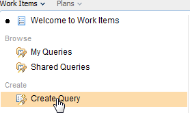
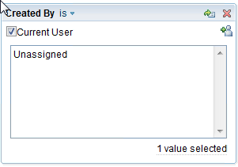
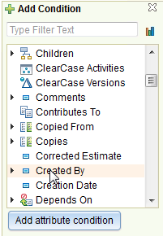
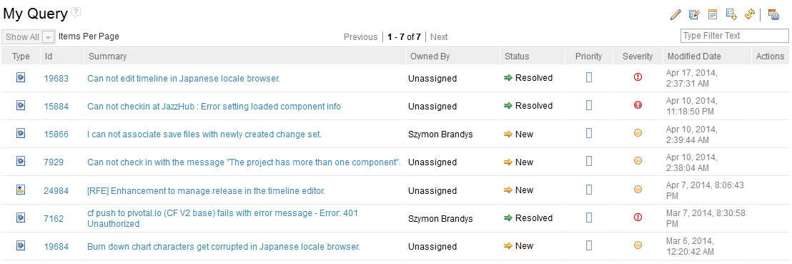

## Work item query

JazzHub offer query capability on work items. As a team lead, you may
want to know how much stories are done so far, and how much stories
are to be implemented in specific interations. In this tutorial,
you will learn how to create a query.

### Create a query.

Creating a query is very simple. In this tutorial, you will create
a query - "My Query" in which you will query work items created by 
you.

1. Select "Work Items -> Create Query"
>  
2. Add "Created by" and select "CURRENT USER" as query value.
>  
>  
3. Save and Run the query.

Query result will be displayed in the botton of the page,
similar to this figure.

>  

