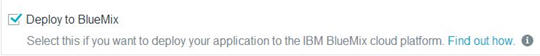

# Create a JazzHub project and add code from a BlueMix starter app

You've just come from [BlueMix where you added a simple Node.JS web server app](starterapp) and ran that app in BlueMix. Since you want to modify the app, your
next step is to create a JazzHub project to hold the app code. 

[Read about JazzHub projects and how to create one](createproject), but be sure to choose a Git hosted repo 

>	

and the option to deploy the app to BlueMix.

>	

Now it’s time to add the starter code into the project. 
You have a couple of choices. You can click **Edit Code** and select from the **File** menu to import individual files or *.zip files. 
Or you can use the Git command line to load your repo. 
[Let's use the command line](#loadrepoforbluemixstarter]. 

## Load your repo with the starter app code by using the Git command line 

So, now you have a repository (also known as a JazzHub project) to hold your code, and a zip file to put in it. Lots of tools can be used to work with Git, including all of the major desktop IDEs and even directly from the web using the JazzHub IDE (which we'll talk about later) but for now let's just use the command line Git support.

First you clone the repository using the URL from the JazzHub auto-deploy page

	git clone https://hub.jazz.net/git/amadeus/MyCoolWebApp

Then you unzip the contents of the zip file into that directory

	unzip  /Users/mcq/downloads/mycoolwebapp.zip

And finally you apply some standard Git magic to push the contents into the repository at JazzHub. First commit the changes to the local clone.

	git add *

	git commit -m "Committing the initial sample code"

And then push them to the remote repository. If you get prompted for your credentials, just enter your Jazz User ID and password.

	git push
	
Now, this is where it starts to get interesting! If you go back to JazzHub and check the auto-deployment page, you'll see the results
of your commit and a message about a missing manifest file. So lets go and check that out at [push changes automatically from the JazzHub auto-deployment page](../Deploy/pushfromjh#autodeploybluemixstarterapp).  
