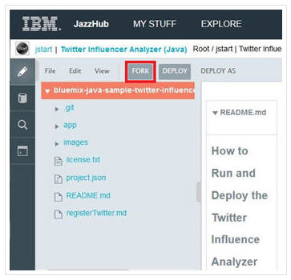
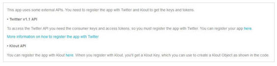
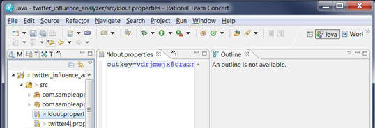
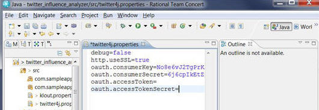

# Fork code from Twitter Influence Analyzer (Java) with Eclipse and JazzHub
Ready to create an app from a Java sample app, then fork the Twitter Influence Analyzer sample app.

1. Open the [Twitter Influencer Analyzer (Java)](https://hub.jazz.net/project/jstart/Twitter%20Influencer%20Analyzer%20%28Java%29/code) sample application on JazzHub. 
2. If you have worked with this sample application before, then you have a copy of it in your local repository. 
To make sure that you have the latest code updates to this sample application in your local repository, 
you must do these steps before you fork the sample. 
    * Click Git Status from the JazzHub code editor to see the base code changes.
	* Click **FETCH** to get these changes from the remote repository. 
	* Click **MERGE** to bring in the updated files into your local repository.
	* Click the pencil icon to return to the JazzHub code editor.
3. From the Web IDE menu, click **Fork** to bring the code into a new project. 
>	
4. In the Fork window, enter a name for your project and then save it. 
>	 

Next you want to set up your development environment so that you can use Eclipse to work with the sample code.  
Read how to do that at [Connect to your JazzHub project with EGit](../Setup/eclipseclient).

If you have set up your development environment, you are ready to configure the sample project. 

## Configure the sample project
The code base that you are using might require configuration changes or other edits. Browse 
the README.md file of the sample project to see notes about what if anything what must be configured. 

>	

The Twitter Influence Analyzer (Java) requires an update to the klout.properties and twitter4j.properties files, 
which are located in the src directory.
>	
>	

Now you're ready to push the sample app to BlueMix. Let's do that. Read how to at [push changes to BlueMix from Eclipse(pushfromelipse). 
 

