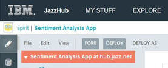
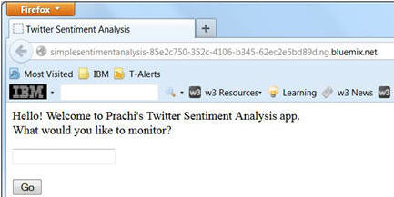
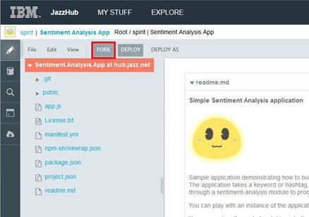

# Fork code from Sentiment Analysis (node.js) with IBM DevOps Services

## Start with the sample app
Before you fork the [Sentiment Analysis App](https://hub.jazz.net/project/spirit/Sentiment%20Analysis%20App/overview) app,
you might want to look at it first. Let's do that. You can see that this sample is a hosted Git project 
and that it contains the manifest.yml file for deployment. Let's suppose that you want to customize
the sample app. That's easy. Clicking **Edit Code** opens the Web IDE 
where you can load the app.js file. Now change the app name on lines 87 and 124. 
Notice that the editor recognizes the file as a Javascript file and highlights everything for you.

>	

After changing the name, you can deploy the application to BlueMix and see your change. 
To deploy the application, you click **DEPLOY**. 

>	

You then check the deployment status shown in the Manual Deployment Information section. 
The status is green, so your deployment was successful.

>	

To see your change, you click the application link, which shows your running app.

>	

## Fork the sample application
Instead of working off a shared code-base, you can fork this code into your own project and 
use it as a starting point for your next application. You fork this code by clicking **FORK** and enter a name 
You get a new project, a new project name, and a copy of the code from the sample project.

>	

Now you can edit app.js in your own project, deploy the changes and see them go live. 
You can manage the live application instance from BlueMix. 
The **Applications** tab on the BlueMix Dashboard has the options to start, stop and delete the application. 
The **Services** tab has options to add various services such as mongodb, SSO, MapReduce and more.

After making changes, you'll want to share them with other users of the project 
so let's push them to the repository. Read how to at [Push changes for the IBM DevOps Services Sentiment analysis app](pushsentimentapp).
