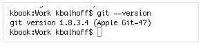
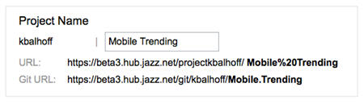
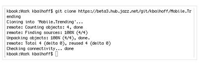
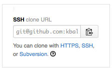

# Connect with a command line  

If you like working with a command line to code, then you've come to the right place. You can
get set up to use the Git command line, work with the Jazz SCM command line, or the Cloud Foundry command line.

***
## Working with Git (hosted by JazzHub or GitHub) 

To work with the Git command line there are a few steps to get set up. First you can
install Git if its not already installed and then you can make a local copy of your 
Git repo hosted at JazzHub.

If you are coding with Eclipse and Git, you might also want to look at  
[Coding with Eclipse plug-ins](eclipseclient).

### Install Git
Check to see if Git is already installed. Open a Terminal and enter: git --version. 
If Git is installed, the command returns with your version. 
>	

If Git is not installed, download and install the version for your platform from [Git](http://git-scm.com/downloads). 
>	

That's it. Now you want to load your Git repo into your local repo. Let's do that next.

### Connect to a Git repo hosted at JazzHub

Find the URL to clone your Git repo from one of the following pages:

* Create a project page. When you create a project on JazzHub with the option to create a Git repo hosted at JazzHub, 
you can copy the Git repo URL from the Create a project page. 
>	
* Project details page. Look for the **Git URL** link.
>	 
* **Settings** tab on the Project page.  
>	

You've got your Git URL, so open a Terminal session and change to the directory
where you want to put the code from your Git repo hosted at JazzHub. 
Next, enter git clone and paste the Git repo URL. The result should look similar to this image:
>	

Your done! With a a local copy of the code for your project, you're ready to code. 
Browse http://git-scm.com/doc to learn more about working with Git. 

### Connect to a Git repo at GitHub from JazzHub

You have a Git repo at GitHub and want to connect to that from JazzHub. That's easy. First
find the URL to clone your Git repo to your local computer. 
View your project page on GitHub and find the URL to clone through your choice of HTTPS or SSH. Next, copy the URL. 
>	

You've got your Git URL, so open a Terminal session and change to the 
directory where you want to put the code from your Git repo hosted at GitHub. 
Next enter git clone and paste the URL from GitHub. If this is the first time you have connected to GitHub 
with the SSH clone URL, you are prompted to validate your key. Once that’s complete, 
try the clone command again. The result should look similar to this image: 
>	

That's it. Now you have a local copy of the code for your project. Browse http://git-scm.com/doc to learn more about working with Git. 

****

## Working with Jazz SCM 

****

## Working with Cloud Foundry 