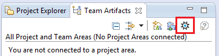

# Work locally with IBM DevOps Services projects and Jazz source control

Last modified: 9 January 2015

If you use Jazz Source Control Management (SCM) for your IBM&reg; DevOps Services project you can  work locally or by using the integrated web IDE. If you work in Eclipse, you can install the IBM&reg; Rational Team Concert&trade; plug-in for version control.

If you use the Track & Plan feature to manage your project plans and work items, and if you install the the Rational Team Concert plug-in, you can also access your work items from Eclipse.

---
##Contents

 * [Install Eclipse and the Rational Team Concert plug-in](#install_eclipse_and_the_rational_team_concert_plugin)
 * [Connect from Eclipse to your DevOps Services projects](#connect_to_your_devops_services_projects_from_eclipse)
 * [Import code from Jazz SCM to Eclipse](#import_code_into_eclipse_from_jazz_source_control)

---

## Install Eclipse and the Rational Team Concert plug-in

**Before you begin**: 
* Rational Team Concert 5.0 and later require Eclipse 4.3.2, and Eclipse requires Java 1.7.  

* If you do not have Eclipse installed and want tools for Java development, [download and install the Java EE IDE for Eclipse](http://www.eclipse.org/downloads/packages/eclipse-ide-java-ee-developers/keplersr2).  

* If you do not have Java 1.7 installed, [download and install the Java SE Development Kit](http://www.oracle.com/technetwork/java/javase/downloads/jdk7-downloads-1880260.html).

**Install the plug-in**
1. In Eclipse, click **Help > Install New Software**.

2. In the Install window, complete these steps:
  1. In the **Work with** field, enter `https://jazz.net/downloads/rational-team-concert/5.0/5.0/p2`
  2. Press Enter to load the contents of the update site.
  3. Select the **Rational Team Concert Client Feature** check box.
  4. Select the **Group items by category** check box
  5. Click **Next** and click **Next** again.
  6. Review the license terms. If you agree to the terms, accept them.
  7. Click **Finish** to install the plug-in.

3. If you see a security warning message, click **OK**.

4. If you are prompted to restart Eclipse, click **Yes**.

---

## Connect from Eclipse to your DevOps Services projects

From Rational Team Concert, you can connect to your projects in two ways:

 * Use the Manage JazzHub Projects tool
 * Accept a team invitation

After you connect to your project, you can access its work items.

Option 1: Connect by using the Manage JazzHub Projects tool

1. In Eclipse, click **Window > Show View > Other > Team Artifacts**.

2. Click the **Manage JazzHub Projects** icon.
 

3. In the **Manage JazzHub Projects** window, enter your Jazz ID and IBM id password to sign in to DevOps Services, and then click **Next**

4. Select the DevOps Services projects to connect to and click **Finish**.

Option 2: Connect by accepting a team invitation

1. In [DevOps Services](https://hub.jazz.net/), browse to your project page.

2. On the right side of the page, click **Configure eclipse client**.

3. Copy the text for the project invitation.

4. In Eclipse, click **File > Accept JazzHub Client Configuration**. If you don't see that menu option, go to **File > Accept Team Invitation**.

5. Paste the invitation text, click **Next**, and then click **Finish**.

6. Enter your Jazz ID and IBM id password to sign in  to DevOps Services.

You connected to your DevOps Services project in Eclipse. To see the new repository connection and project area, click the **Team Artifacts** tab.

---

## Import code from Jazz SCM to Eclipse 

From yourDevOps Services project that uses Jazz SCM, [connect to a project from Eclipse](#connect_to_your_devops_services_projects_from_eclipse). Then create a repository workspace and load your components into Eclipse.

1. In Eclipse, click **Window > Show View > Other > Team Artifacts**.

2. Expand your project area to show the **Source Control** folder.

3. Right-click the **Source Control** folder, and click **New > Repository Workspace**

4. Select the stream to flow to, and click **Next**. Specify a new name for your repository workspace. Add the word `Eclipse` to the name. Click **Finish**.

5. The tool continues with more steps. 
6. Load all of the projects from the components in the new repository workspace into your local instance of Eclipse by clicking **Find and load Eclipse projects**. Click **Next**.

7. Select the Eclipse projects to load into your local Eclipse instance, and click **Finish**.

8. If you are working on an existing project with code, click the **Package** tab or **Project Explorer** tab to browse the loaded files, open a file, and edit code.

[18]: https://developer.ibm.com/answers/questions/?community=devops-services (DevOps Services forum)
[19]: mailto:hub%40jazz.net
[20]: /docs
