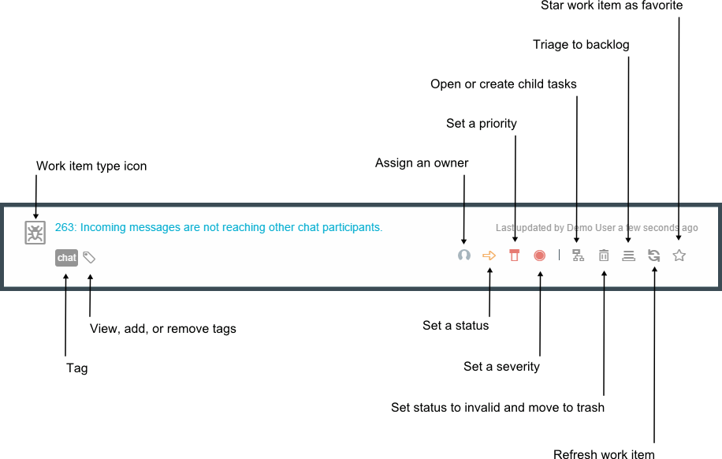
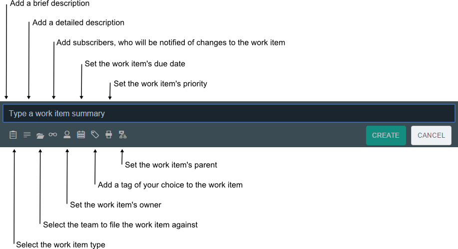

# Track & Plan

Last updated: 17 February 2015

##Managing work items

###Searching for a work item
You can search for a work item by an ID or a keyword. Results display below the search field as you type.

###Work item states
- **Open**: Items that are not started and have the New status.
- **In progress**: Items that are started and have the In progress status.
- **Resolved**: Items that are finished and have the Complete or Invalid status.

###Work item display options
####List display
Each work item spans the width of the section and can be expanded for more detail. Attributes are displayed as icons.

####Table display 
Each work item displays in a condensed format. Some attributes are displayed in a textual format and are arranged into columns.

####Lane display
Work items are grouped by states and attributes are displayed as icons. Two states are visible at one time. Scroll horizontally to view the third state.

###Filtering work items
In the **My work**, **My subscribed**, **Incoming work**, **Backlog**, **Sprint planning**, **Team's work**, and **All work** views, you can filter work items based on keywords or on values for specific attribute types. If you type in a keyword, the work item summaries that contain that keyword will display. To filter work items based on values for specific attributes, refer to the following table.

| Variable |Example | 
|-------|-------|
|*Type  | *Defect |
|#Tag  | #conference| 
|@:Owner  | @:jasmith|
|^Category|^Development team|
|$Priority|$High|
|!Severity|!Major|

###Managing your work items

- To view work items that you own, you can see them in the **My work** view. 
- To view a subset of your important work items, you can star them and see those work items in the **My starred** view. The star is only applied in your My starred view. The star will not display for anyone else subscribed to the work item. 
- To view all of the work items that you are subscribed to, see the **My subscribed** view.
- To view your work items sorted by their modified date, see the **My Recent Work** view.
- To view a feed of your work item activity, see the **My activities** view. The **My Events** section includes a list of work items that you were mentioned in. The **My Subscriptions** section includes a list of all of the changes that occurred in work items that you are subscribed to.

###Managing work items for the project

####Triaging work items
Check the **Incoming work** view to see new work items that team members or guests create. Work items display in the Incoming work view when they are not assigned to a sprint. As soon as they are assigned to a sprint, they no longer display in the Incoming work view.

Options for triaging work items in the Incoming work view:
- Click the **Trash this item** icon to reject the work item. The work items is resolved and the status is changed to **Invalid**.
- Click the **Triage to backlog** icon to accept the work item and assign it to the backlog. Then the work item can be evaluated against other work items in the **Sprint planning** view and assigned to a specific sprint.
- Open the work item and assign it to a specific sprint.

####Planning work for the team
In the **Sprint planning** view, you can plan sprints by dragging ranked work items between sprints. Drag work items between lanes to reassign them. 

Tip: Click the pin icon to keep a lane open. If you pin open the backlog, you can move work items easily from the backlog to a specific sprint.

You can also review statistics about the sprint's progress.

Available statistics:
- Hours worked vs. total hours estimated
- Work items completed vs. total work items
- Story points acheived vs. total story points estimated

#####Ranking work items
Review the work items in the **Backlog** and Sprint Planning views to rank work items while planning a sprint
- Assign story points to work items
- Drag work items into position to assign them a rank

####Reviewing the team's progress
In the **Team's work** view, review all of the work items assigned to the team and statistics for the team's progress.

Available statistics:
- Hours worked vs. total hours estimated
- Work items completed vs. total work items
- Story points acheived vs. total story points estimated

You can also use the **All work** view to review all of the work items by state.

##Creating work items
Where you create the work item affects its settings. If you create a work item in the **My work** view, the work item is automatically owned by you. Set attributes when you create a work item by clicking the icons. You can also click the summary of a work item to open and edit work item attributes.

