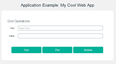

# Using the tutorials Markdown template

<!---
Your introduction goes here. Put the main points and key phrases in this section. Make your introduction
succinct. Aim for three to five sentences that tell the reader why they would care about the content (motive)
and what he or she can gain from reading and doing this tutorial (benefits).
-->

Welcome to the Markdown template to create tutorial content. You can use this template as a basis for a new tutorial, 
or use it to help you prepare existing content for a tutorial.

Tutorials are delivered to DevOps Services in HTML5 format and are generated from a Markdown format. 
Prior to delivery, validate the Markdown source of each tutorial for acceptable markup as defined in this template
by opening your Markdown file with the **Orion Markdown Viewer**. 

This template provides examples of common constructs used in tutorials. 
Following the guidelines in this template can help you create content that is consistent and converts well to HTML. 

The easiest way to create tutorial content with this template is to follow these steps.

1. Copy this template folder.
2. Paste this template into the docs folder. When you do so, give your template folder
the name tutorial_xxx where xxx
is the name of your tutorial.Then rename the tutorials_template.md to tutorials_xxx 
where xxx is the name of your tutorial.
3. Add your own content to your tutorial so you can compare it to the content here, 
refering to these instructions as needed.
4. Read your tutorial checking for typos and that you are following the guidelines mentioned in the template.
5. When you are ready to deliver your work, remove the instructions, and stage, commit and push it to the master branch. 

That's it!

---
### Contents
<!---
Your table of contents goes here. List the sections and sub sections in your tutorial. The contents is a quick way
for the reader to find content. This section supports the thinking behind providing smaller tutorials within a
given tutorial.
-->

- [Section titles, major headings, and minor headings](#section_titles)
- [Code listings or preformatted text](#code_listings)
	- [Major headings](#major_headings)
	- [Minor headings](#minor_headings)
- [Lists](#lists)
- [Code downloads](#code_downloads)
- [Figures](#figures)
- [Tables](#tables)
- [Links](#links)
- [Sidebars](#sidebars)
- [Videos](#videos)
- [Horizontal rule](#horizontal_rule)
- [Conversational style](#conversational_style)
- [Highlighting conventions](#highlighting_conventions)
- [Notes and hints](#notes_and_hints)
- [Markdown summary for content](#markdown_summary)
- [Inline HTML](#inline_html)
- [A final note](#summary)
- [What's next](#whats_next)
- [Tell us what you think](#feedback)
- [Check content against IBM style](#check_content_against_IBM_style)
- [Check content with SMEs](#check_content_with_SME)
- [Link definitions](#link_definitions)

---

# Section titles, major headings, and minor headings

<!---
Make your section titles and headings descriptive and sentence style.  The titles and headings 
should clearly present what the content is all about. 
-->

Tutorials are structured into sections. Major headings divide each section into logical pieces. 
For tutorials, create a tutorial section title using level 1 headings, as for the title above this paragraph. 

The title shows in the contents section of this tutorial so users can easily move between major sections. 
It is a good idea to use short, succinct titles rather than long, verbose ones.

Within each section you'll have several paragraphs of content, perhaps including illustrations, tables and code listings. 

## Major headings
Sections are comprised of smaller information chunks we'll call major sections, using level 2 headings, as the heading above this paragraph.   

### Minor headings
Long major sections can be broken into smaller subsections that we'll call minor sections, using level 3 headings. Create minor headings by using the level 3 heading, as the heading above this paragraph.

Minor headings help organize the content under major headings. 
Within minor sections you can use paragraphs of content, perhaps including illustrations, tables and code listings, as you did for major sections.

Lower level headings are used for figures, code listings, tables, and sidebars. We'll discuss those when we get to those elements.

---

# Lists

You'll often have lists in your content. These can be unordered (bulleted) or ordered (numbered). 

In this example, an ordered list is shown with an ordered sub list. An indented paragraph is also shown in this
example.

1. First ordered item
   
   You can indent a paragraph in a list item too.
   
2. Next ordered item
	* Sub ordered item
	* Sub ordered item
3. Last ordered item

In this example, an unordered list is shown with an unordered sub list.  

* First unordered item
* Second unordered item
  * Sub unordered item
  * Sub unordered item
* Last unordered item

---

# Code listings or preformatted text

Content often includes small snippets of code or a command within a sentence, 
or longer code listings that are two or more lines of code and set off from the rest of the text.  

You create inline code using back ticks. For example, to run the program, enter `runme.bat` on the command line.

For listings, limit each line of code in your code listing to no more than 
90 monospace characters (including spaces). For longer code lines, find suitable 
places to split the lines; long lines do not wrap automatically. Code lines longer than 90 
monospace characters will eventually cause formatting errors that you will have to resolve, 
so use the ruler line below to check the lengths of your lines.
 
Indent your code lines as needed by using the space bar.  Use the tab key to show the code
as a code block. And include a caption for your code listing; code listing captions use a Heading 
level 3, as do figure, table, and sidebar captions.

Limit code listing length to no more than 100 lines. 
For a listing longer than 100 lines, divide it into smaller listings, or
Excerpt the most important lines, and consider offering the entire code listing as a download.  

### Listing 1. Sample code listing at maximum width
	|--------10--------20--------30--------40--------50--------60--------70--------80--------|
	CODE LINE 1 HAS 90 CHARACTERS – YOUR LINES MUST BE NO LONGER THAN THIS 0000000000000000000
	CODE LINE 2 – USING 8PT CODE HELPS LONG LINES FIT IN YOUR PAGE.
	   CODE LINE 3
	   CODE LINE 4
	      CODE LINE 5
	CODE LINE 6

---

# Code downloads

If you have downloadable code to go with your content, contact the tutorials project owner for guidance. 

---

# Figures

Technical graphics such as screen captures, diagrams, and photographs enhance and help explain your content. 
To learn how to create screens, read [screen capture guidelines][1]
Include a caption above the figure. Figure captions use a level 3 heading, as do code listings, tables, 
and sidebar captions. Your graphics must have alt text to comply with accessibility 
requirements. 

To reduce the amount of space taken up by graphics, make the graphic a thumbnail and clickable so that the reader can click
the graphic to see it full size.  

Figure 4. Caption for your figure
 
[![BlueMix starter app running][2]][3]

This line above, in combination with the link definitions at the bottom of this document combine to produce a clickable image link. 

As an alternative, you can use html tags to produce the same result.

---

# Tables

Tables can help explain your content. 

### Table 1.Caption for your table

|  Column heading 1  |  Column 2 heading  |  Column 3 heading  |
| ------------------ |:------------------:| ------------------:|
| 1234               |right aligned       |              $1600 |
| 5768               |     centered       |         $12        |
| 4444               |left aligned        |$1                  |

---

# Links 

<!---
When you add links to other tutorial content, instead of the text repeating a section or
heading title, make the link text conversational. 
-->

You can link to Web pages, such as the [BlueMix home page][4] or 
to locations in this tutorial, such as [Code listings or preformatted text](tutorials_template#codelistings). 
You can also link to locations in another tutorial. For example, **Note**: If you need to install Git, 
take a look [here][5].

---

# Sidebars (not available yet)

Use a sidebar for a content detour or reinforcement. 
For example, you might define terms or provide a bit of historical background in a sidebar. 
Or you might summarize the key points of a lengthy discussion.  

To create a sidebar, we need a change to our css. Here
is some information about a [simple sidebar][6]
The final sidebar is right aligned and typically 30% of the page width. 

Give your sidebar a heading. Sidebar headings use Heading level 3, as do code listing, table, and  figure captions.  

---

# Videos

One or more videos can help reinforce your content.

1. Get the embed code from the desired youtube video. 
2. Add that code to the Markdown source as shown. Make sure there is a blank line before and after the iframe tag.

<iframe width="640" height="390" src="//www.youtube.com/embed/tLbv7iLAPQI" frameborder="0" allowfullscreen></iframe>

---

# Horizontal rule

Separate logical sections with a horizontal rule. 

---

# Conversational style

Try to write your content as if you're talking to someone about it. 
Read [text style guidelines][7] for guidance.

---

# Highlighting conventions

When do you use italics, bold, or no highlighting at all? Table 2 shows the highlighting conventions recommended for developerWorks content.

### Table 2. Recommended highlighting

| Highlighted element |	Recommended highlighting | 
|--------------------:|-------------------------:|
| "Article titles"	  | "Quotes"                 |
| Book titles	      | _book title_             |
| Code (inline)       | `code`                   |
| Classes	          | `classes`                |
| Code (block) 	      | Use tab key              |
| Command names	      | `command`                |
| Directory names	  | No highlighting          |
| Emphasis	          | _emphasis_               |
| File names	      | `file name`              |
| Function calls	  | `function call`          |
| GUI controls	      | **Add Git integration**  |
| Window titles       | No highlighting          |
| Dialog titles		  | No highlighting          |
| Keywords            | `keywords`               |
| Message text        | `message text`           |
| Message prompts     | `message prompt`         |
| Methods	          | `methods`                |
| Objects             | `objects`				 |
| Path names          | No highlighting			 |        
| Terms               | _term_					 |
| Text entered by user| `entered text`			 |
| Types (such as int) | `int`					 |
| URLs	              | No highlighting          |
| Variables           | `variable`               |

---

# Notes and hints
You can include notes or hints in your content. 

Here is an example of a note. 

**Note**: The **Deploy** button in the Web IDE deploys the current state of your code in your Web IDE, whereas auto-deploy deploys 
from what is checked into the repository.

Here is an example of a hint. 

**Hint**: The title was Application Example: run DataCache using REST API: 
You might need to refresh your browser to ensure the updated page is displayed.

---

# Markdown summary for content

* Headings.
  * Heading 1 for major sections
  * Heading 2 for minor sections
  * Heading 3 above the code listing, table, and  figure for captions.  Heading 3 also for sidebar headings.
* Body text should be standard text like you see here and with no font conventions.
* **Bold** and _italic_ are fine, but use the [highlighting conventions](#highlighting_conventions). Avoid underlining, color and other font effects.
* Inline code use `back ticks`
* Code listings use tabs
* Keep tables simple. Use Heading level 3 for the caption.

There are many references about Markdown syntax. [Here](http://daringfireball.net/projects/markdown/syntax) is one for your reference.

---

# Inline HTML
You can use HTML tags in your Markdown. The anchors to create the contents entries for this template use
HTML tags as do the comments tags. 

---

# A final note 

<!---
Your summary goes here. Put the main points of what you covered and why what you covered is of value. 
-->

Here is some example text for your reference.

You've seen how easy it is to create a node.js web app at BlueMix and run that app. 
With a few clicks you created a Git repo, loaded it with the example code and automatically 
deployed the app. In minutes you changed the code and pushed it using the Git command line and the 
Web IDE, automatically ran a build and deploy, checked the status of the app deployment, 
and ran the app to show your changes. That's all there is to it.

For those of you who made it this far, we hope this tutorial has given you a feel for how to get started 
with BlueMix and DevOps Services using Node.js. Lots of details were glossed over, but the documentation links at the start can fill those in.

---

# What's next
<!---
Tell readers what they can do next.
-->

Interested in trying more BlueMix and DevOps capabilities? Here is a list of tutorials:

* [Getting Started with BlueMix and DevOps Services using Node.js][10]
* [Getting Started with BlueMix and DevOps Services using Java][11]
* [Setting up Eclipse, Git, and RTC Desktop Clients to access DevOps Service][12]
* [Developing BlueMix applications in Node.js with the DevOps Services Web IDE][13]
* [Developing BlueMix applications in Java with Eclipse and DevOps Services][14]

---

# Tell us what you think
<!---
Tell readers what they can do next.
-->

Thanks for following along. And tell us what you think. What did we do well? 
What can we do better? Post your comments to our [forum][8] 
or send us an [email][9].

---

# Check your content against IBM style

Run the Acronlinx IQ Desktop Checker to check your text quality against IBM style guidelines.
Read the instructions to [setup and run this checker][15].  

---

# Check your content with SMEs

<!---
Add in the comments section who your SME is for technical review and
approval. 
-->
Make sure your tutorial is reviewed and approved by your Subject Matter Expert (SME).

---

# Link definitions

<!---
Add your link definitions to the bottom of your document to make it easier to maintain them.
-->

   [1]: https://releaseblueprints.ibm.com/display/CLOUDOE/Cloud+OE+Content+Design#CloudOEContentDesign-Screencaptures (BlueMix Screen Capture Guidelines)
   [2]: images/app-new-title-sml.png 
   [3]: images/app-new-title-lge.png
   [4]: https://ace.ng.bluemix.net/ (BlueMix website)
   [5]: ./../tutorial_clients/tutorial_clients#gitinstall
   [6]: https://github.com/colingourlay/simple-sidebars/blob/master/README.markdown
   [7]: https://releaseblueprints.ibm.com/display/CLOUDOE/Cloud+OE+Content+Design#CloudOEContentDesign-BlueMixtextstyleguidelines (BlueMix Style Text Guidelines)
   [8]: https://www.ibmdw.net/answers?community=jazzhub (forum)
   [9]: mailto:hub%40jazz.net
   [10]: ../tutorial_jazzeditor/tutorial_jazzeditor (Getting Started with BlueMix and DevOps Services using Node.js)
   [11]: ../tutorial_jazzeditorjava/tutorial_jazzeditorjava (Getting Started with BlueMix and DevOps Services using Java)
   [12]: ../tutorial_clients/tutorial_clients (Setting up Eclipse, Git, and RTC Desktop Clients to access DevOps Services)
   [13]: ../tutorial_jazzweb/tutorial_jazzweb (Developing BlueMix applications in Node.js with the DevOps Services Web IDE)
   [14]: ../tutorial_jazzrtc/tutorial_jazzrtc (Developing BlueMix applications in Java with Eclipse and DevOps Services)
   [15]: https://w3-connections.ibm.com/files/app#/file/92d4625e-47e4-405a-985b-94baa86daaf1 (Acronlinx IQ Desktop Checker)