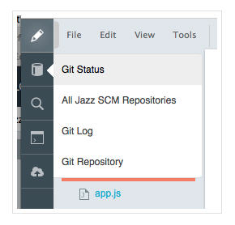
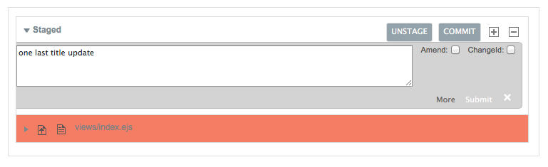
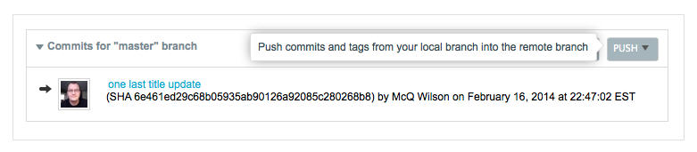
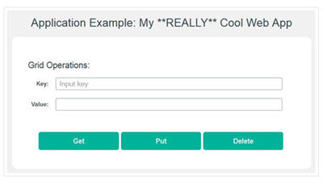

# Push more changes for the BlueMix starter app from the Web IDE
You've just made [changes to your BlueMix starter app code by using the Web IDE](editjheditor). 
You can then use the integrated Git support to push the change.

You start by switching to the Git Status page.

>	

Where you can then stage

>	

commit

>	

and push the change 

>	

just like you did with the command line (only with a few more clicks and a lot less typing). 
And then, finally, you can see once again that your app was updated.

>	

If auto-deployment is on, your changes are automatically deployed to BlueMix.

You've completed the [guide to develop code from a BlueMix starter app](../Guides/guidebm). 
