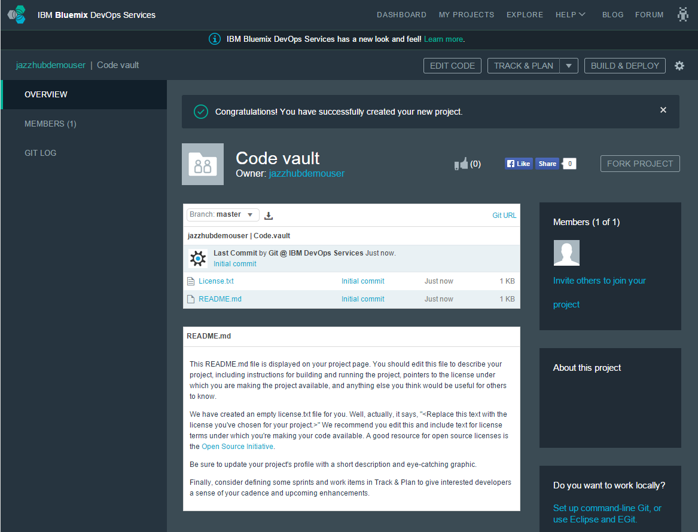
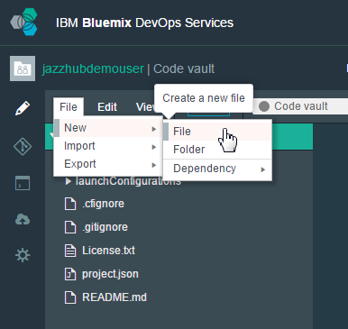
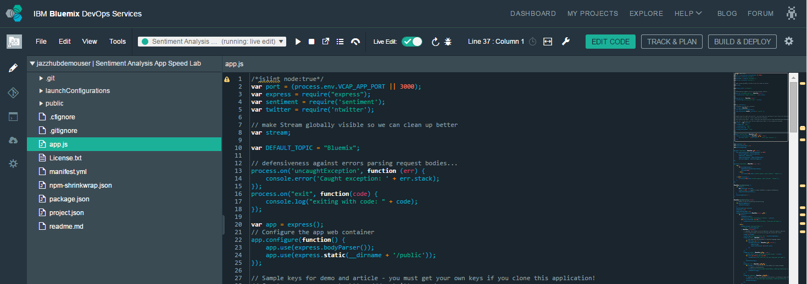
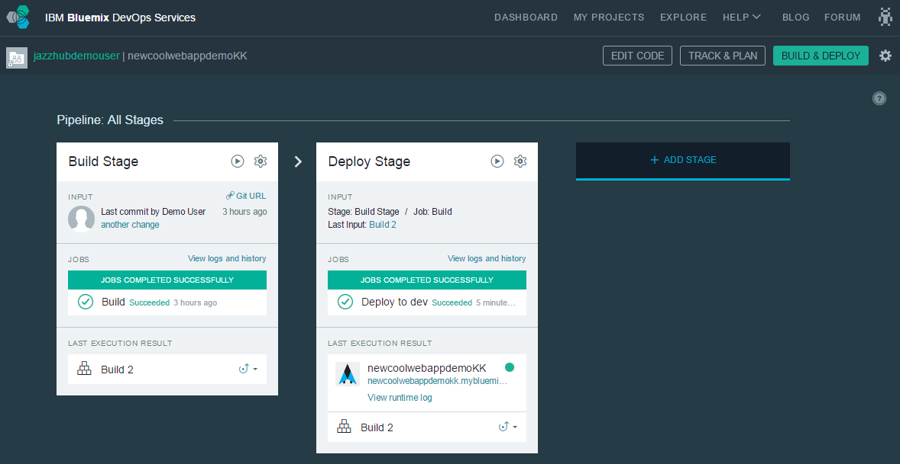
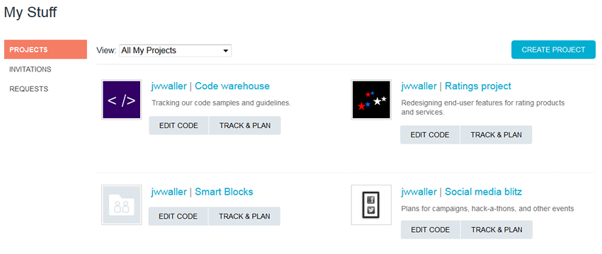

# Features - IBM DevOps Services

## What's New
Check out the latest enhancements, features and capabilities at our [What's New](https://beta3.hub.jazz.net/whatsnew) page.							

## Simple user interface for starting a project quickly

Easily add the "who, what, and when" of your development project. 
It only takes a few minutes to set dates, document your first user
story, assign a task or two, and dive in to the code.	
 
																				

## No install, just code now

Start coding immediately after you create a project. 
Click **Edit Code** to get started!

															

## Integrated source code editor

The Web IDE provides smart features including content assist for CSS, HTML, and JavaScript.

* Easily import your source code
* Copy a file by dragging it to a new directory
* Syntax highlighting and code validation
* Editing features for coding quickly, including keyboard shortcuts, and bracket and block-comment auto-completion
* Key-bindings for vi and emacs users

											

## Build and deploy your way

Configure your project to automatically deploy to [IBM Bluemix](https://ace.ng.bluemix.net/IBM Bluemix) 
whenever a project member pushes code to your Git repository or
Jazz SCM. You can simply deploy files as they are pushed, or you
can configure more advanced build options to be deployed automatically.

To learn more about configuring and using the various build and deploy capabilities,
see the tutorial [Getting Started with Bluemix and DevOps Services using Node.js](https://beta3.hub.jazz.net/tutorials/jazzeditor)
or [Getting Started with Bluemix and DevOps Services using Java](https://beta3.hub.jazz.net/tutorials/jazzeditorjava).

									
							
## Git hosting

It's simple to track, plan, and develop your project, and you don't have to 
give up your favorite SCM.  You can quickly create a project with a 
Git repository to share your source with team members (private 
projects), or the world.  Edit your source, push commits, and 
automatically deploy changes to	the cloud, all without leaving your
browser. And, don't worry, your favorite Git client is supported too.
 
		
 
## Connect with your GitHub repository
			
It's easy to link work items with GitHub code changes: use your existing 
tools to code, and manage your project with DevOps Services.  You 
can reference a work item in the GitHub comments before you push 
code changes, and the work item is updated with the new commit.

		

## Your work in one place

It's My Stuff. Get a quick view of the projects you own, belong	to, and
 like. See project invitations and requests too. Just another way 
to help you stay organized.

																		 

## Built-in source code management						

Easy code delivery and seamless tracking of changes from all developers. 
Each project gets a Git repository or a Jazz source code management
 repository and workspace where project members check in changes, 
associate code changes with work items, and view a history of recent 
updates.
																				

## Work items to track and plan project activities						

Track who's doing what, and when it will get done. Need a design? Open a task
 and assign it to the person with the wireframing tools. Something 
not working? Then, open a defect.  Hidden benefit: expect a warm 
fuzzy when you complete a work item, and the status changes to Done.

		
																			
## Dashboard charts for project status										

Choose from over 50 widgets to customize your dashboard! Use a burndown chart 
for tracking team velocity and work-item and source-control widgets
 to track individual work.
 
