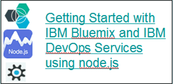

 

<h1 style="color:#FFFFFF">&nbsp;&nbsp;Featured content</h1>

 

 
<h1> Topics </h1>

<a href="/docs/nodejs.md">node.js</a>

<a href="/docs/java.md">Java</a>

<a href="/docs/mobile.md">Mobile</a>

<a href="/docs/eclipse.md">Eclipse</a>

<a href="/docs/project_man.md">Program management</a>

<a href="/docs/git.md">Git</a>

<a href="/docs/git.md">Projects</a>

<a href="/docs/deploy.md">Deploy</a>
 

 

<h1> [Browse all docs}(/docs/all) </h1>

<!--

 
<h1 style="color:#F47D64">Most popular </h1>
 
<h2>1. [Getting Started with IBM Bluemix and IBM DevOps Services using node.js](/tutorials/editor) </h2>
Tutorial | Views: 20000 | Tags: bluemix, node.js, devops
 
<h2>2. [Developing IBM Bluemix applications in Node.js with the Web IDE](/tutorials/ ) </h2>
 
<h2>3. [link 3]( ) </h2>
 
4. [link 4]( )
 
5. [link 5]( )

 

-->

<!--

<h3> Tutorial: [Developing IBM Bluemix applications in Node.js with the Web IDE](/tutorials/jazzweb) </h3>

<h3> Article: [Creating a Node.js application with JazzHub](http://www.ibm.com/developerworks/community/blogs/jlmarechaux/entry/creating_a_node_js_application_with_jazzhub?lang=en) </h3>

<h3> Article: [Build a sentiment analysis application with Node.js, Express, sentiment, and ntwitter](http://www.ibm.com/developerworks/library/wa-nodejs-app/)	</h3>

<h3> Sample: [Sentiment analysis (Node.js)](http://hub.jazz.net/project/Scott/Sentiment%20Analysis/overview)</h3>
<h3> Sample: [Starfighter web server and interface for Cloudant (Node.js)](http://hub.jazz.net/project/bryancboyd/Starfighter/overview)</h3>

<!--

<h3> Article: [Build a real-time polls application with Node.js, Express, AngularJS, and MongoDB](http://www.ibm.com/developerworks/library/wa-nodejs-polling-app/) </h3>
<h3> Sample: [Building a real-time polls application (Node.js, AngularJS, and MongoDB)](http://hub.jazz.net/project/joelennon/polls/overview)</h3>
-->

<h1 style="color:#89C639">Java app</h1>
<h3> Tutorial: 
<h3> Sample: [Twitter influence analyzer (Java and MongoBD)](https://hub.jazz.net/project/jstart/Twitter%20Influencer%20Analyzer%20%28Java%29/overview)</h3>

 

<h1 style="color:8781BD">Mobile app</h1>

<h3> Video: [The ShelterBox App (2:05 min)](http://www.youtube.com/watch?v=E1qXvrEh0nU)

<h1 style="color:darkblue">Projects and Git</h1>
<h3>Explore: [Projects]( )</h3>
<h3>[manifest.yml file]( )</h3>
<h3>[Git quickstart]( )</h3>

<h1 style="color:#93A2AA"> Eclipse enviroment </h1>
<h3> Tutorial: [Developing IBM Bluemix applications in Java with Eclipse and IBM DevOps Services](/tutorials/jazzrtc) </h3>
<h3> Tutorial: [Setting up Eclipse, Git, and Rational Team Concert desktop clients to access IBM DevOps Services](/tutorials/clients) </h3>

<h1 style="color:green"> Project management</h3>
<h3><b>NEW </b> Tutorial: [Getting started with tracking and planning in IBM DevOps Services](/tutorials/trackplan)</h3>
<h3>Explore: [Track and plan](https://coltrane-new.rtp.raleigh.ibm.com:4000/features/trackplanfg)</h3>

		

			

 

<h1 style="color:orange">Code and deploy</h1>
<h3>Explore: [Web IDE]( )</h3>
<h3>[Deploy and auto-deploy]( )</h3>

<!--
<h1 style="color:darkblue">General</h1>
<h3> Article: [Develop apps in the cloud with DevOps Services](http://www.ibm.com/developerworks/library/d-bluemix-devops-services-project/)</h3>
<h3> Video: [Developing in the cloud, for the cloud (3:43 min) ](http://www.youtube.com/watch?v=qZW_2w8kGWY)

<h3> Video: [Using IBM DevOps Services (formerly JazzHub) to deploy applications to the cloud (6:32 min)](http://www.youtube.com/watch?v=mo5u42rE1_0)

<h3> Video: [Discover IBM DevOps Services (formerly JazzHub), your place to develop and deploy software in the cloud -(37:00 min)](http://www.youtube.com/watch?v=tLbv7iLAPQI)</h3>
<h3>[IBM DevOps Services YouTube channel](http://www.youtube.com/user/JazzHub)</h3

<h3> Sample: [Twitter influence analyzer (Python and Bottle framework)](http://hub.jazz.net/project/jstart/Twitter%20Influence%20Analyzer%20%28Python%29/overview)</h3>

<!--

<h3 style="color:#FF962D"> See the latest</h1>

<h3>  [Learn about IBM DevOps Services](http://hub.jazz.net/learn)
<h3>  [What&rsquo;s new](/whatsnew)
<h3>  [Features](/features)
<h3>  [Frequently asked questions](/help/faq)
<h3>  [Glossary](/glossary)

<h1>Ask a question or report a bug</h1>

<h3>[IBM DevOps Services forum](http://developer.ibm.com/answers?community=jazzhub)</h3>

<h3>[IBM Bluemix forum](http://developer.ibm.com/answers?community=bluemix)</h3>

<h3>[Report a bug](http://hub.jazz.net/ccm01/web/projects/srich%20|%20JazzHub#action=com.ibm.team.dashboard.viewDashboard)</h3>

<h3>[Contact us](/help)</h3>
		

<h1>Be social</h1>

<h3> [Facebook](http://www.facebook.com/jazzhub)</h3>
<h3> [Twitter](http://twitter.com/JazzHub)</h3>
<h3> [Blog](http://jazz.net/search/?q=jazzhub#page=0&type=type%3DDocument-Blog&q=jazzhub)	</h3>

<h1>Tell us what you think of this page</h1>

<h3>[Post to the IBM DevOps Services forum](http://developer.ibm.com/answers?community=jazzhub)	</h3>

-->
