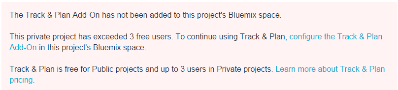

{\rtf1\ansi\deff0{\fonttbl{\f0\fnil\fcharset0 Calibri;}}
{\*\generator Msftedit 5.41.21.2510;}\viewkind4\uc1\pard\sa200\sl276\slmult1\lang9\f0\fs22 #Configuring IBM Bluemix billing for IBM DevOps Services\par
\par
\par
IBM&reg; DevOps Services provides the Track & Plan and Delivery Pipeline services for IBM Bluemix&trade;.\par
All DevOps Services projects include an allowance of free services. To avoid interruptions when you exceed your allowances, you must set up a Bluemix billing account and configure your services. \par
\par
You can set up your Bluemix billing account independantly from setting up your DevOps Services project at any time before your free services run out. Don't worry, you won't forfeit your free allowance when you set up billing. \par
As a project owner you can set up a DevOps Services project in two ways:\par
* Create an app on Bluemix -> add a Git repository -> connect the Bluemix space to one of the services in the DevOps Services catalog \par
* Create a project using DevOps Services -> configure it to deploy to Bluemix -> add either the Track & Plan or Delivery Pipeline services to your Bluemix space\par
\par
Either way, managing your billing account is the same. When your trial period ends or if your project requires advanced features immediately, we give you the tools to manage your account and monitor your usage.\par
\par
---\par
\par
### Understanding billing thresholds\par
\par
Your team's work is free until you reach a billing threshold by using up your free allowance. After you exceed those allowance thresholds, your service will be interrupted unless you set up your Bluemix billing account.\par
\par
<table border="1" summary="" width="100%">\par
\tab <tbody>\par
\tab\tab <tr>\par
\tab\tab\tab <th>Service</th>\par
\tab\tab\tab <th>Charging metric</th>\par
\tab\tab\tab <th>Free allowance</th>\par
\tab\tab\tab <th>Cost</th>\par
\tab\tab </tr>\par
\tab\tab <tr style="background-color: #FFFFFF">\par
\tab\tab\tab <td rowspan="2">Delivery Pipeline</td>\par
\tab\tab\tab <td>Build minutes</td>\par
\tab\tab\tab <td>60 minutes per application (project), per month</td>\par
\tab\tab\tab <td rowspan="2">See Bluemix [Pricing Sheet](https://ace.ng.bluemix.net/#/pricing/)</td>\par
\tab\tab </tr>\par
\tab\tab <tr style="background-color: #FFFFFF">\par
\tab\tab\tab <td>Application instances (deployers)</td>\par
\tab\tab\tab <td>First two application instances (deployers) per application (project), per month</td>\par
\tab\tab </tr>\par
\tab\tab <tr style="background-color: #EBEBFF">\par
\tab\tab\tab <td rowspan="2">Track &amp; Plan</td>\par
\tab\tab\tab <td rowspan="2">Users per application</td>\par
\tab\tab\tab <td>Private project: Three users</td>\par
\tab\tab\tab <td rowspan="2">See Bluemix [Pricing Sheet](https://ace.ng.bluemix.net/#/pricing/)</td>\par
\tab\tab </tr>\par
\tab\tab <tr style="background-color: #EBEBFF">\par
\tab\tab\tab <td>Public project: Unlimited users</td>\par
\tab\tab </tr>\par
\tab </tbody>\par
</table> \par
\par
If a billing account hasn't been established for your project and you get close to exceeding your billing threshold, you will receive a warning similar to this:\par
\par
\par
**Note:** The user responsible for setting up billing might not be the same user who triggers a warning. Enabling your Bluemix billing account right away will protect your project from build and deployment failures and blocked access to Track & Plan pages.\par
\par
---\par
##Enabling your Bluemix account\par
To protect your project from service interruptions it's a good idea to enable your Bluemix billing account by configuring the services that your project needs right away. Before you can do that, you need a Bluemix account and a DevOps Services project. If you need details, here are two tutorials to get you started:\par
* [Getting started with Bluemix and DevOps Services using Node.js](https://hub.jazz.net/tutorials/jazzeditor/)\par
* [Getting started with Bluemix and DevOps Services using Java&trade;](https://hub.jazz.net/tutorials/jazzeditorjava/)\par
\par
Delivery Pipeline and Track & Plan are the services that link your Bluemix space and DevOps Services projects together.\par
\par
To enable your account for billing, complete these steps:\par
1. Go to the your Bluemix dashboard and select your space. \par
2. Click **Services** and select either **Delivery Pipeline** or **Track & Plan** from the DevOps catalog.\par
3. Make sure the space that corresponds to your DevOps Services project is selected and click **Create.**\par
\par
\par
\par
---\par
##Monitoring your usage\par
\par
You can manage your Bluemix account by viewing [billing and usage](https://www.ng.bluemix.net/docs/#acctmgmt/index-gentopic1.html#bil_usage) information and determine costs by visiting the [Bluemix Pricing page](https://bluemix.net/#/pricing).\par
\par
The Delivery Pipeline and Track & Plan services\par
use metered pricing, where you pay based on consumption, but they also include a free\par
monthly allowance. You can find more information about pricing from the DevOps section of the \par
[Bluemix Pricing page](https://bluemix.net/#/pricing).\par
\par
To help you monitor monthly usage, see the cost estimator on the [Bluemix Pricing page](https://bluemix.net/#/pricing).\par
\par
To see your usage details from **Profile Settings > Account > Usage Details**.\par
\par
\par
### Choosing a billing plan\par
\par
Before your free trial period expires, decide which billing plan \par
is best for your project. Read [Bluemix plans](https://www.ng.bluemix.net/docs/#acctmgmt/billing.html#bil_plan)\par
to see billing plan details.\par
\par
\par
---\par
##Account terminology\par
\par
For account management, you need to know how we define a few key terms for billing. \par
1. **Application** - A uniquely named software program that is separately installable on \par
a computing device. For billing purposes, an IBM DevOps Services \par
project is an application.\par
2. **Application Instance** - An instance of an application connected to or managed \par
by the cloud service (Bluemix and IBM DevOps Services). An application in multiple environments, such as test, development, staging, and \par
production, is counted as separate instances. Multiple copies of an application running in the same environment are counted as separate instances. Your billing charges are calculated for each application instance beyond the free threshold. Also called "application instance (deployer)." \par
3. **Application User** -  An authenticated user who accesses an application. For each application managed by Bluemix and IBM DevOps Services, you will be charged for each \par
authenticated user who accesses that application during the billing period. Multiple authentications by a \par
single user to a single application count as a single application user. A single user authenticating to \par
multiple applications counts as multiple application users. \par
Note: For the purposes of this charge metric, Application is defined to be an IBM DevOps Services \par
Project, and membership in a Project during a billing period is deemed to be access to that Project during \par
that billing period. Each Application-User is billed on a monthly basis. Partial month usage is not available at this time. \par
4. **Deployment Stages** - Deployment stages are the steps in application development used for testing and running software. (Typical stages are "staging," "test," "QA," and "production.") For billing purposes, deployment stages are application instances.\par
5. **Organization (Orgs)** - The grouping methodology for users in Bluemix. Organizations are used to manage quotas. Users in an org share memory and service instance quotas. \par
6. **Space** - A sub-group within a Bluemix organization. Users who are members of an organization are given access to one or more of its spaces, with permissions associated with a particular role (such as developer, manager, or auditor). Any member of the space can view apps, but only members with the developer role can create apps and add service instances to the space. Apps and service instances are associated with spaces. \par
\par
Additional resources: \par
* [IBM Continuous Delivery Pipeline for Bluemix](http://www.ibm.com/software/sla/sladb.nsf/pdf/6616-01/$file/i126-6616-01_06-2014_en_US.pdf)\par
* [IBM Track and Plan for Bluemix](http://www.ibm.com/software/sla/sladb.nsf/pdf/6615-01/$file/i126-6615-01_06-2014_en_US.pdf)\par
* [IBM DevOps Services Terms of Use](https://hub.jazz.net/terms)\par
\par
\par
\par
&copy; Copyright IBM Corporation 2013, 2014.\par
}
