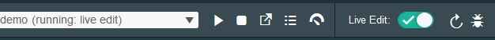

#Overview of Bluemix DevOps Services 

Last modified: 27 April 2015

Time: 30 minutes

 ---

## Learning objectives

Learn how to use IBM Bluemix DevOps Services to  do integrated agile planning, coding, building, and deploying to the IBM Bluemix Platform.  You will find step-by-step instructions for the video 
<a href="https://www.youtube.com/watch?v=VJesera9jR0" target="_blank">An Overview of IBM Bluemix DevOps Services by Adam Archer</a>

# Steps
* Part 1: Getting started
   * 1.1 Create a sample app
   * 1.2 Add DevOps Services
   * 1.3 Edit the application with Live Edit
   * 1.4 Automated deployment on Git push
* Part 2: Growing your project
   * 2.1 Invite a team member
   * 2.2 Create a task backlog
   * 2.3 Create and plan a sprint
* Part 3: Working as a team
   * 3.1 Join a project
   * 3.2 Pick up a task
   * 3.3 Develop independently
   * 3.4 Collaborate with traceability
* Part 4: Going to production
   * 4.1 Add a production environment

---

##Before you begin

[Sign up for DevOps Services](https://hub.jazz.net/register). When you sign up, you'll create an IBM id, create an alias, and register with Bluemix. 

---
# Part 1: Getting started
---
 

## 1.1 Create a sample app

  On the Bluemix website, you can find  [Getting Started with Bluemix](https://www.ng.bluemix.net/docs/#) and  [Bluemix Overview](https://www.ng.bluemix.net/docs/#overview/overview.html#overview).

1. [Sign in to Bluemix](https://www.ng.bluemix.net). The Dashboard opens:

<!-- The Dashboard shows an overview of the active Bluemix space for your organization. 
By default, the space is `dev` and the organization is the user name of the person who created the project. 
For example, if `bob@example.com` logs in to Bluemix for the first time, the active space is `dev` and the organization 
is `bob@example.com`.
If you create more organizations or spaces in Bluemix, use the same ones as you follow the tutorials. Use the default selections. -->

1. Click **CREATE AN APP** and then click **WEB**.  

3. Click **SDK for Node.js** and then click **CONTINUE**.

4. Name your app and then click **FINISH**. The name is a unique URL where you access your app. 
After a moment, the app starts. The app's Dashboard page opens with the start coding page displayed.  Click **Overview** in the left nav and see that the app is running.

<!-- 
Now that your app is running, you can see and modify its code by using DevOps Services.-->

---

## 1.2 Add DevOps Services

<!--You can work with your app's code in many ways. For example, with auto-deploy, you can modify the code that runs in your app by pushing your changes to a Git repository. You can auto-deploy your code if you use the Build & Deploy capabilities of DevOps Services. -->

1. To create a Bluemix DevOps Services project with auto-deploy enabled, go to your app's Overview page on the Bluemix Dashboard and click **ADD GIT**.  You might be prompted to enter your password to verify that DevOps Services can act on your behalf. 
<!-- -->

2. Make sure that the **Populate the repository with the starter application package and enable build and deploy** check box is selected and click **CONTINUE**.

You created a Git repository, populated it with the example code, and deployed the app.

## 1.3 Edit the application with Live Edit

  With Node.js apps, you can make changes to static files, like HTML or CSS, and have them immediately propagated to the deployed app by using the Bluemix Live Sync feature.

1. Go to the app's Overview page in Bluemix and click **EDIT CODE** (this button replaced the ADD GIT button). Your new project opens in the web integrated development environment (Web IDE).  
<!-- -->

1. In the Web IDE, turn on Live Edit mode.

2. Click **OK** to redeploy in debug mode.  Once you turn on Live Edit, the app is redeployed in debug mode.  The Web IDE deployment uses files in the Project's cloud workspace. 

 
3. To see your updated static files, refresh the deployed app in the browser.  

  If you update a node module, use the **Quick Restart** icon to restart the node run time in a matter of seconds, without redeploying the app.

<!-- You can use the Debug feature to create breakpoints and inspect variables in your node modules so you can isolate problem areas as you work. -->
 
<table border="0"><tr><td></td><td>  For more information and to learn about the Desktop Sync feature, see 
[Bluemix Live Sync](https://www.ng.bluemix.net/docs/#manageapps/bluemixlive.html#bluemixlive).</td></tr></table>

4. In the directory, click on `public/index.html`.  Change "Hi there!" to "Hi there! More title text!". You can see the changes in the deployed app.  

**Note** that in the video Adam edits the views/body.jade file, but that file is no longer in the starter pack, so you are going to edit the index.html file to get the same results.

For more information on editing, see Web IDE.

---

## 1.4 Automated Deployment on Git Push

1. Push the change by using the integrated Git support. 

	a. From the leftmost menu, click the **Git Repository** icon.
	
	b. Select the changed files in the Working Directory Changes pane.

	c. Add a commit message and click **Commit** to put these changes in the local master branch.
	
	d. Click **Push** to put these changes to origin/master branch.

7. To verify that your new code was deployed, 
go to the Build & Deploy page and wait until you see an indication that the 
app was deployed again. Then, click the URL link that is next to "Deploy to." Your update is shown.

# Part 2: Growing your project
---
## 2.1 Invite a team member
1. Click the project name in the nav bar to open the project overview page.
2. Click **MEMBERS** and then click **INVITE MEMBERS**.
3. Enter the email address of the member to invite and then click **INVITE**. 

---

 
## 2.2 Create a task backlog
1. In the nav bar, click **TRACK & PLAN**.

2.  Click the **Projects Settings** link to turn on Track and plan for this project.

3. In the Project options, click **Enable Track & Plan** on and click **SAVE**.

4. In the nav bar, click **TRACK & PLAN** again.
and click the **SPRINT PLANNING** view from the nav on the left.

5. In the backlog lane, add a few work items by typing the summary, click **Enter** in the **Type a a work item summary**  field, and then click **CREATE**.
Create these three work items:

   * Update the title of the page
   * Add a new paragraph of text
   * Update the image

---
## 2.3 Create and plan a sprint

1. Create a Sprint by clicking  **Add Sprints** and then clicking **CREATE** to create Sprint 1.  You may need to refresh your window to see the new Sprint 1 lane.

2. Drag the task from the Backlog lane to the Sprint 1 lane to update the planned for field.

---
# Part 3: Working as a team - Steps for the new member

## 3.1 New member joins project 

1. Your new member should click on the link in the email invitation to the project. (or the new member can signup and then log in as the new member, click **My Projects** and then click **INVITATIONS**.

2. Enter an alias to use and click **Finish**.

3. To deploy to Bluemix using your own space, you need to register for a free Bluemix Trial.  Enter your phone number and click **Continue**.

2. Click **ACCEPT** to join the project.

3.  Click the project name to open the project.

## 3.2 Pick up a task

1. Click on **TRACK&PLAN** to plan  your work.
2. Click the **SPRINT PLANNING view, in the Sprint 1 lane, see the three work items.  The work item about updating the title is unassigned, so assign it to you by clicking on the circle with a question mark and selecting your name from the pulldown. 

3. For the same work item, set the status by clicking the right arrow next to the owner and selecting **Start working** from the pulldown.  This work item is **In progress** since you are going to start working on it now.

## 3.3 Develop independently

1. Click **EDIT CODE**.  This will create a clone of the project in your project cloud workspace.

2. In the Run bar, from the **Create new launch configuration** pulldown, select **+** to create your own launch configuration.
Since you want to deploy to the same account as the original project, get the ID and password for the Bluemix account of the project owner.

3. In the Edit launch configuration dialog, change the host to be unique.

4. You can change the code and since you have Live Edit on, your changes will be deployed automatically while the original deployed app is unchanged.  For example, change Hi there to Hello in the public/index.html.  Click on the Open the application URL icon in the Run bar to see your version of the deployed app.

## 3.4 Collaborate with traceability
1. In the Web IDE (click **EDIT CODE**), click the Git Repositry icon on the left nav.
2. In the Commit field, add a comment and include the Task ID to link to the work item.
3. Select the file to commit.
4. Click **COMMIT**.
5. Click **PUSH**.
6. Verify you see the commit in the work item by clicking **TRACK & PLAN** and then clicking on the work item.
7. In the work item,  click the LINKS tab and see the commit info in the Change Sets.
8. Since you have committed the change for this work item, change the status to **Complete** and click **SAVE**.
9. Verify your latest change is on the official version of the deployed app.  It is updated since we have configured auto-deploy on a Git push.
---
#  Part 4: Going to production

## 4.1 Add a Production Environment - the project owner

1. Back as the project owner, click **BUILD & DEPLOY**.

2. Click **ADD STAGE** and name it `Production`.

3. Turn off autodeploy by clicking **Only execute jobs when a user manually runs this stage** in the Stage Trigger field.

4. Click on the **JOBS** tab and then click **+** to add a job of type Deploy.

5. Enter a new Bluemix **Space** name by clicking **Create new space**, typing the new name, and clicking **CREATE**. 

6. Give this deployment a unique host name by changing the deployment script a the name parameter -n so it is now `cf push "${CF_APP}" -n "new-name"`.

6. Click **SAVE** and then click the play on the Production stage to deploy.

7. Click Run stage to trigger the first production deployment.  When the app has deployed, in the Production stage tile, click the deployed app URL to see the app running in production.

---

##Summary

You should now have a good overview of how to get started with IBM Bluemix DevOps Services integrated agile planning, coding, building, and deploying to the IBM Bluemix Platform. 

You saw how to create and run a Node.js web app by using Bluemix. 
With one click, you created a Git repository, populated it with example code, and automatically 
deployed the app.  You then made a change and saw that the change was automatically deployed by Live Edit. You then grew your project by inviting another member, created a backlog of work items and planned a sprint. The new project member accepted the invitation, took a work item, made changes and deployed to a separate Bluemix URL and then pushed the changed code and resolved the work item.  As the project owner, you crated a production stage and deployed to a production URL.

[1]: /tutorials/jazzeditor/images/runbar_green.png
