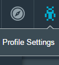

#Configuring IBM Bluemix billing for IBM DevOps Services

IBM&reg; DevOps Services provides the Delivery Pipeline and Track & Plan services for IBM Bluemix&trade;. The first thing you do with DevOps Services is create a project, which is a collection of artifacts that an individual or team develops and typically deploys as an application in Bluemix. All DevOps Services projects include an allowance of free services. If you exceed your allowances, your work is interrupted. To avoid interruptions, set up a Bluemix billing account and configure your services.

If you already set up a DevOps Services project, you can set up your Bluemix billing account at any time before your free services run out. When you set up a billing account, you still keep your free allowance.

As a project owner, you can set up a DevOps Services project and configure billing in two ways:
* Create an app on Bluemix > add a Git repository > add either the Delivery Pipeline service, the Track & Plan service, or both to the Bluemix space where you created the app.
* Create a project by using DevOps Services > configure the project to deploy to Bluemix > add either the Delivery Pipeline service, the Track & Plan service, or both to the Bluemix space that is configured in your project settings. 

Either way, managing your billing account is the same. When your trial period ends, you are notified that you must configure billing before you can continue using the services.

---
### Billing thresholds
If you plan to use the Delivery Pipeline and Track & Plan services beyond the free allowance, you must configure both services. When you configure one service, the other isn’t affected; each service requires a separate billing configuration.

### Table 1. Billing threshold details
<table border="1" summary="" width="100%">
	<tbody>
		<tr>
			<th>Service</th>
			<th>Charging metric</th>
			<th>Free allowance</th>
			<th>Cost</th>
		</tr>
		<tr style="background-color: #FFFFFF">
			<td rowspan="2">Delivery Pipeline</td>
			<td>Build minutes</td>
			<td>60 minutes per application (project), per month</td>
			<td rowspan="2">See Bluemix [Pricing Sheet](https://ace.ng.bluemix.net/#/pricing/)</td>
		</tr>
		<tr style="background-color: #FFFFFF">
			<td>Application instances (deployers)</td>
			<td>First two application instances (deployers) per application (project), per month</td>
		</tr>
		<tr style="background-color: #EBEBFF">
			<td rowspan="2">Track &amp; Plan</td>
			<td rowspan="2">Users per application</td>
			<td>Private project: Three users</td>
			<td rowspan="2">See Bluemix [Pricing Sheet](https://ace.ng.bluemix.net/#/pricing/)</td>
		</tr>
		<tr style="background-color: #EBEBFF">
			<td>Public project: Unlimited users</td>
		</tr>
	</tbody>
</table> 

If a billing account hasn't been established for your project and you are close to exceeding your billing threshold, warnings are shown periodically. If you exceed your billing threshold, you are blocked from the service or services.

**Note:** The person who is responsible for setting up the billing account might not be the same person who receives a warning. To protect your project from build and deployment failures and blocked access to the Track & Plan pages, ask your Bluemix manager or billing manager to enable your Bluemix billing account early.

If you are the person who is responsible to set up a billing account, before you can set it up, you need a Bluemix account and a DevOps Services project. For instructions, see these tutorials:
* [Getting started with Bluemix and DevOps Services using Node.js](https://hub.jazz.net/tutorials/jazzeditor/)
* [Getting started with Bluemix and DevOps Services using Java&trade;](https://hub.jazz.net/tutorials/jazzeditorjava/)

---
##Setting up a billing account

Before you set up your billing account, review the [Bluemix plans](https://www.ng.bluemix.net/docs/#acctmgmt/billing.html#bil_plan) to select the best plan for your project.

To set up your billing account, complete these steps: 
1. Go to your Bluemix dashboard and select the space that is listed in your DevOps Services project settings. 
2. Click **Services**, and from the DevOps section, select either **Delivery Pipeline** or **Track & Plan**.
3. Make sure that the space that corresponds to your DevOps Services project is selected.
4. Choose a billing plan.  
5. Click **Create.**

---
##Monitoring your usage

You can monitor the usage details for your Bluemix account. For information, see the [billing and usage](https://www.ng.bluemix.net/docs/#acctmgmt/index-gentopic1.html#bil_usage) documentation. To determine costs, see the [Bluemix pricing](https://bluemix.net/#/pricing) page.

The Delivery Pipeline and Track & Plan services use metered pricing, where you pay based on consumption; however, they also include a free monthly allowance.

To help monitor monthly usage, see the [cost estimator](https://ace.ng.bluemix.net/#/pricing/paneId=pricingSheet) on the Bluemix Pricing page.

To see your usage details, click **Profile Settings  > Account > Usage Details**.

---
##Billing terminology

Several terms pertain to billing; for example, *application instance* and *application user*. To become familiar with the billing terminology, see these DevOps Services documents:
* [IBM Continuous Delivery Pipeline for Bluemix](http://www.ibm.com/software/sla/sladb.nsf/pdf/6616-01/$file/i126-6616-01_06-2014_en_US.pdf)
* [IBM Track and Plan for Bluemix](http://www.ibm.com/software/sla/sladb.nsf/pdf/6615-01/$file/i126-6615-01_06-2014_en_US.pdf)
* [IBM DevOps Services Terms of Use](https://hub.jazz.net/terms)

To gain a general understanding of terms such as *orgs* and *spaces*, see these Bluemix documents:
* [Bluemix organizations and spaces](https://www.ng.bluemix.net/docs/?cm_mc_uid=&cm_mc_sid_50200034|BLUEMIX=#acctmgmt/index.html#organdspaces)
* [Bluemix Terms](https://www.ng.bluemix.net/docs/?cm_mc_uid=&cm_mc_sid_50200034|BLUEMIX=#navigation/notices.html#terms)

&copy; Copyright IBM Corporation 2013, 2014.
