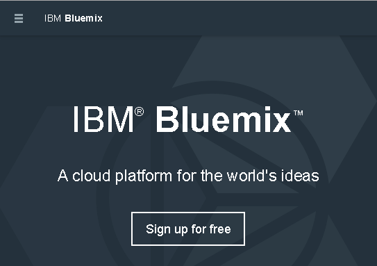
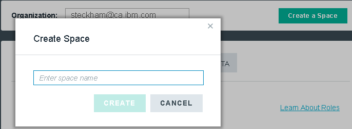
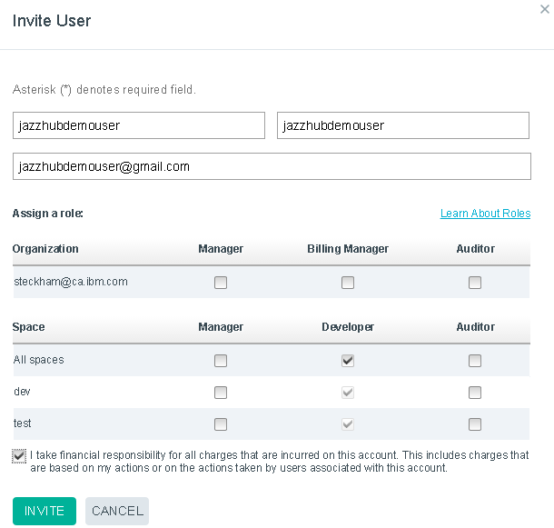
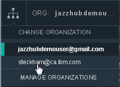
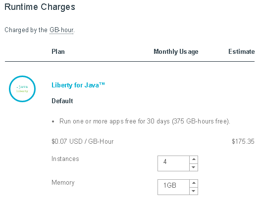
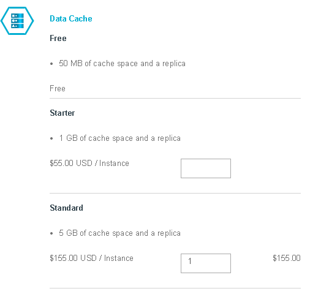
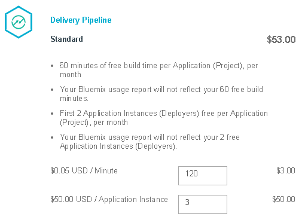
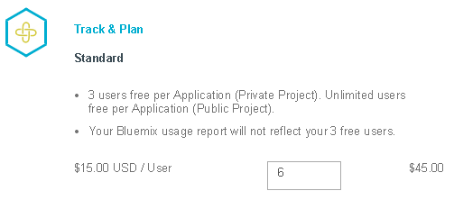

#Setting up your Bluemix account to work with IBM DevOps Services

---
##Set the stage

You are a development manager with one or more developers on your team. You want your team to 
build an application and see it running in the public cloud. You also want to plan and track the app dev work. 
You team is going to use IBM&reg; DevOps Services as a 
tool to develop the app and IBM Bluemix&trade; as the 
place to deploy the app to. You are new to Bluemix, billable
services and DevOps Services. To keep things simple you own the Bluemix account and
can perform all operations on organizations and spaces, including the billing information
for the organization. 

To get set up you're going to need a Bluemix organization and a Bluemix space. After that, you invite 
each developer to join your Bluemix organization and space.  As a developer joins, the developer
can create a Bluemix app that is hosted in a 
Git repository DevOps Services project.  As soon as that app is in your Bluemix space, 
you can add the Bluemix Track & Plan Add-On and the Bluemix Delivery Pipeline Add-On to that space. Then
all the applications in that space can use those Add-Ons. Finally,
you can monitor your Bluemix account usage, estimate your Bluemix costs, and get ready
to sign up for a pay account as your trial usage expires.

---
##Create a Bluemix account 

Start by getting a Bluemix account. 
To get an account, go to the [IBM Bluemix home page](https://bluemix.net/) and 
click **Sign up for free**.

While you are at the Bluemix site take a look around for information about 
what Bluemix is all about. 

---
##Create a Bluemix organization and space 

With your account, log in to Bluemix, which takes you to a dashboard.

The dashboard gives you an overview of the active 
Bluemix space for your organization. 
By default, the space is `dev` and the organization is the account owner's username.
For example, if `BobMgr@example.com` logs in to Bluemix for the first time, 
Bob's active space is `dev` and Bobs organization 
is `bobMgr@example.com`.

To open the Manage Organizations page, on the menu go to **Change to a different org > MANAGE ORGANIZATIONS**.

Make sure you as the account owner have all three roles.

Create another space in your organization and call it `test`. A developer can configure
a deployer stage within IBM DevOps Services to target this Bluemix space when the app is ready to be
deployed to a test stage.  

---
##Invite a developer to your Bluemix organization

Next, assign a developer to your organization and grant the developer permission to use the 
spaces within the organization. 

To open the Invite User dialog box, click **Invite a New User** from the
Manage Organizations page. 

After you invite a user, a message shows that the user was added, but you must let that user
know.
 
----
##Tell the developer to create an app in a Bluemix space

Tell the developer to get a Bluemix account by using the same steps that you just did. Then
ask the developer to log in to Bluemix and go to **Change to a different org** on the menu, look for your organization, and 
select it.

Next, ask the developer to create an app in that organization in the default `dev` space by following the instructions
in the [Getting Started with IBM Bluemix and IBM DevOps Services using Java](/tutorials/jazzeditorjava)
tutorial. 

When the app is created it shows in the Bluemix dashboard.

Now you can connect the DevOps Add-Ons to the organization space so that all applications in that space
can use it.

---
## Connect the DevOps Add-Ons 

Add the Delivery Pipeline Add-On to the dashboard. 
With this Add-On, developers can configure and run an Ant or Grunt builder and any number of deployer stages 
to create a multi-stage deployment pipeline to your Bluemix spaces.

1. From the Bluemix dashboard, click **Connect An Add-On** and 
select Delivery Pipeline from the catalog.
2. From the Delivery Pipeline page, click **CREATE**. 
The Delivery Pipeline dashboard opens where you can see the app that your developer created. 

Next, add the Track & Plan Add-On to the dashboard to help manage your team's work.

1. From the Bluemix dashboard, click **Connect an Add-On** and select Track & Plan from the catalog.
From the Track & Plan page, click CREATE. 
The Track & Plan dashboard opens where you can see the application that your developer created. 
2. Turn Track & Plan on for the project by clicking the **State** value **OFF**. 
The Project Settings page opens in DevOps Services where you can select the option to 
enable Track & Plan.

When you return to the dashboard, you can
see the DevOps Add-Ons listed.

---
##Tell the developer that the DevOps Add-Ons were added

Tell the developer the Delivery Pipeline Add-On and the Track & Plan Add-On are
configured and ready to use. 

Each developer can use the Delivery Pipeline Add-On to see a listing of
their DevOps Services projects and their state (SIMPLE, ADVANCED, OFF) 
of BUILD & DEPLOY use. The developer can quickly check the status of their builds, 
deployed app, and most recent deployments, or easily go to your most recent build logs 
or deployment details.

Each developer can also use the Track & Plan Add-On to see a listing of their DevOps Services projects 
and their member count, visibility, and whether the TRACK & PLAN capability is enabled. 
The developer can quickly and easily create a new work item for any of their
listed DevOps Services projects or go to their planning tools.

For example, another developer on the team runs the Java&trade; web application in the Bluemix dashboard 
and notices a problem. The developer opens the Track & Plan dashboard, finds the application in the list and clicks 
**CREATE**.

The Track & Plan capability in DevOps Services opens where the
developer can create a defect work item.

---
##Manage your Bluemix account

You can manage your Bluemix account by viewing usage information and by using the Bluemix cost estimator.

###Monitor usage 

You can monitor usage details from your profile settings.

The usage view shows the runtime GB-hours and service consumption 
metrics per month. 

### Estimate costs

When you signed up for a 30-day free trial, your account 
came with some resources free of charge. 
To see what resources are free, see [Free trial](https://www.ng.bluemix.net/docs/#acctmgmt/billing.html#bil_freetrial).

The Delivery Pipeline Add-on and the Track & Plan Add-on
use metered pricing, where you pay based on consumption but they also include free
monthly allowances. You can find more information about pricing from the DevOps section of the 
[Bluemix Pricing page](https://bluemix.net/#/pricing).

To help you estimate the monthly usage costs, you can easily price your costs
by using the cost estimator on the [Bluemix Pricing page](https://bluemix.net/#/pricing).

For example, assume that you have a Java web application 
that uses the following Bluemix services and items:

- Four runtime instances that use 1 GB of memory per month 

- 2 GB per month data cache

- 120 minutes of build time per month and 3 deployer stages

- 6 users per app per private project 

To keep the example simple, assume that the prices shown 
do not fluctuate within or between a time frame, for example, a month. 
All pricing in this example is in US currency.

When all the items are added, you can see the total price of the application.

---

### Choose billing plan

Before your free trial period expires, you need to decide what billing plan 
you are going to use. Read [Bluemix plans](https://www.ng.bluemix.net/docs/#acctmgmt/billing.html#bil_plan)
to see what billing plan is best for you.

---
##Summary

You should now have a good overview of how to set up a Bluemix account, organization and one or more
Bluemix spaces. You know how to invite users to your space and how to add the DevOps Add-Ons to your
Bluemix space. Finally, you saw how to prepare for billing by viewing account usage information, 
estimating monthly costs and reading about billing plans.

Tell us what you think. What worked well? 
What could be better? Post your comments to the [IBM DevOps Services forum](https://www.ibmdw.net/answers?community=jazzhub) 
or send an [email](mailto:hub%40jazz.net).

---
##Tutorials

To learn more about Bluemix and DevOps Services capabilities, see these tutorials:

* [Getting Started with IBM Bluemix and IBM DevOps Services using Java](/tutorials/jazzeditorjava)
* [Setting up Eclipse, Git, and Rational Team Concert Desktop Clients to access IBM DevOps Services](/tutorials/clients)
* [Developing IBM Bluemix applications in Node.js with the IBM DevOps Services Web IDE](/tutorials/jazzweb)
* [Developing IBM Bluemix applications in Java with Eclipse and IBM DevOps Services](/tutorials/jazzrtc)    
* [Getting Started with tracking and planning using IBM DevOps Services](/tutorials/trackplan)  
    
&copy; Copyright IBM Corporation 2013, 2014.
