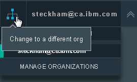
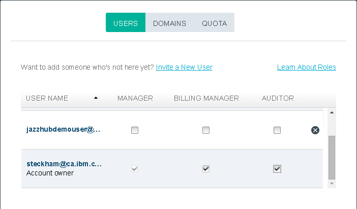
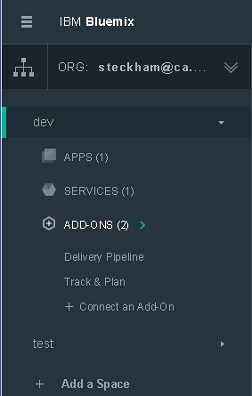
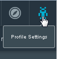
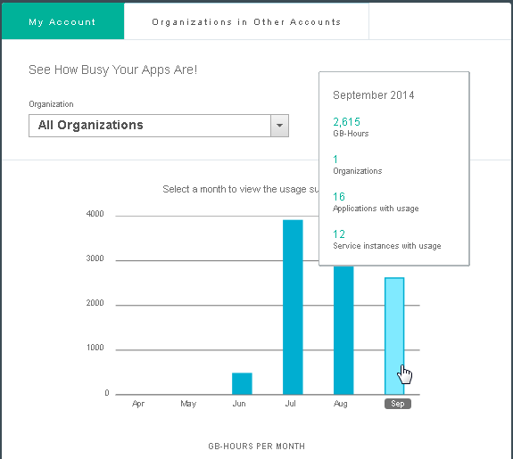

#Account Quick Reference
--- 

You can do amazing work for free with IBM DevOps Services, but when your project evolves to the point where you need more, we've got you covered.
##Starting your project

As a project owner you can set up your project in two ways:
1. Set up a project using DevOps Services and deploy it to Bluemix
2. Create an app on Bluemix and add DevOps Services Add-ons 

Either way, managing your account is the same. When your trial period ends or if your project requires advanced features immediately, we give you the tools to manage your account and predict your expenses.

---
##Setting up your account
To manage your billing, you must have a Bluemix account. Go to the [IBM Bluemix home page](https://bluemix.net/) and 
and log in or sign up for a new account.

1. Log in to Bluemix, which takes you to a dashboard. The dashboard gives you an overview of the active 
Bluemix space for your organization. 
By default, the space is `dev` and the organization is the account owner's username.

2. To open the Manage Organizations page, on the menu go to **Change to a different org > MANAGE ORGANIZATIONS**.

3. Select **Manager,** **Account Manager,** and **Auditor.** As the account owner, you should have all three roles.

5. You or a developer you invite to your organization can now create an app, which will show up in the Bluemix dashboard.

6. Connect the DevOps Add-Ons to the organization space so that all applications in that space
can use them. Click **ADD-ONS** > **Connect An Add-On** and 
select **Delivery Pipeline** or **Track & Plan** from the catalog.

Note: Delivery Pipeline and Track & Plan are the DevOps Services that link your Bluemix and IBM DevOps Services projects together.

---
##Managing your billing

You can manage your Bluemix account by viewing usage information and by using the Bluemix cost estimator.

###Monitor usage 

You can monitor usage details from your profile settings.

The usage view shows the runtime GB-hours and service consumption 
metrics per month. 

### Estimate costs

When you signed up for a 30-day free trial, your account 
came with some resources free of charge. 
To see what resources are free, see [Free trial](https://www.ng.bluemix.net/docs/#acctmgmt/billing.html#bil_freetrial).

The Delivery Pipeline Add-on and the Track & Plan Add-on
use metered pricing, where you pay based on consumption but they also include free
monthly allowances. You can find more information about pricing from the DevOps section of the 
[Bluemix Pricing page](https://bluemix.net/#/pricing).

To help you estimate the monthly usage costs, you can easily price your costs
by using the cost estimator on the [Bluemix Pricing page](https://bluemix.net/#/pricing).

### Choose a billing plan

Before your free trial period expires, decide which billing plan 
is best for your project. Read [Bluemix plans](https://www.ng.bluemix.net/docs/#acctmgmt/billing.html#bil_plan)
to see billing plan details.

### Billing thresholds

Your team's work is free until you reach the following thresholds:
1. More than three users on a private project (you can have more than three users on public projects)
2. More than two stages in a multi-stage deployment to Bluemix
3. More than 60 minutes of build time per month

If your project never reaches those thresholds, you can use DevOps Services for free indefinitely.

---
##Account terminology

For account management, you need to know how we define a few key terms for billing. 
1. **Application** - An application is a uniquely named software program that is separately installable on 
a computing device. For billing purposes, application is defined to be an IBM DevOps Services 
Project.
2. **Application Instance** - An application instance is an instance of an application connected to or managed 
by the cloud service (Bluemix and IBM DevOps Services). An application in multiple environments, such as test, development, staging, and 
production, is counted as separate instances. Multiple copies of an application running in the same 
environment are also counted as separate instances. Your billing charges are calculated for each application instance beyond the free threshold. Also called "application instance (deployer)." 
3. **Application User** -  An authenticated user who accesses an application. For each application managed by Bluemix and IBM DevOps Services, you will be charged for each 
authenticated user who accesses that application during the billing period. Multiple authentications by a 
single user to a single application count as a single application user. A single user authenticating to 
multiple applications counts as multiple application users. 
Note: For the purposes of this charge metric, Application is defined to be an IBM DevOps Services 
Project, and membership in a Project during a billing period is deemed to be access to that Project during 
that billing period. Each Application-User is billed on a monthly basis. Partial month usage is not available at this time. 
4. **Deployment Stages** - Deployment stages are the steps in application development used for testing and running software. (Typical stages are "staging," "test," "QA," and "production.") For billing purposes, deployment stages are application instances.
5. **Organization** - ?? Bluemix ??
6. **Space** - ??Bluemix??

Link to these terms docs? 
http://www-03.ibm.com/software/sla/sladb.nsf/pdf/6616-01/$file/i126-6616-01_06-2014_en_US.pdf
http://www-03.ibm.com/software/sla/sladb.nsf/pdf/6615-01/$file/i126-6615-01_06-2014_en_US.pdf

&copy; Copyright IBM Corporation 2013, 2014.
