# Building a website with GitHub pages and DevOps Services 

This tutorial shows you how to set up a new website with GitHub pages and IBM&trade; DevOps Services. 
With DevOps Services you can connect to an existing GitHub project that you can edit using the DevOps Services Web IDE.

To start the tutorial you set up accounts and repositories. Then you push your first page to GitHub. 
After that you can log in to DevOps Services, code your project, and push when you like.

Not bad to establish a website.

---
## Create a GitHub account and repository

If you do not have a GitHub account, you must create one at [github.com](github.com).

Next create a repository. Click **+New repository**.

The new repository name is the Github user name followed by `.github.io`. For 
example if your 
user name is `mygithubtry`, the repository name is `mygithhubtry.github.io`.
This is a special repository that provides a working website. 

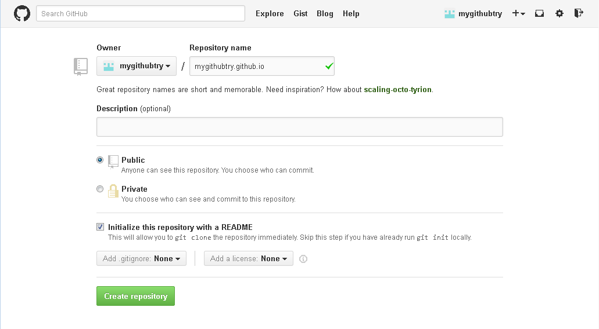

---
##Create a DevOps Services account and project

In another browser tab, go to [hub.jazz.net](hub.jazz.net), which is a suite of software to 
manage and develop projects in the cloud. Create an account if you do not have one.

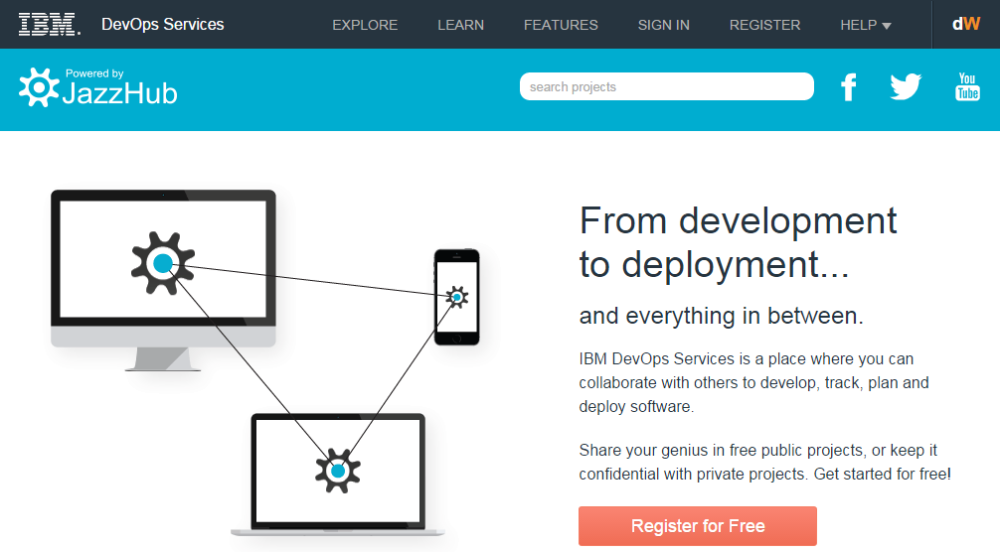

After you sign in, the My Stuff page opens. Click **Start coding in a new project**.

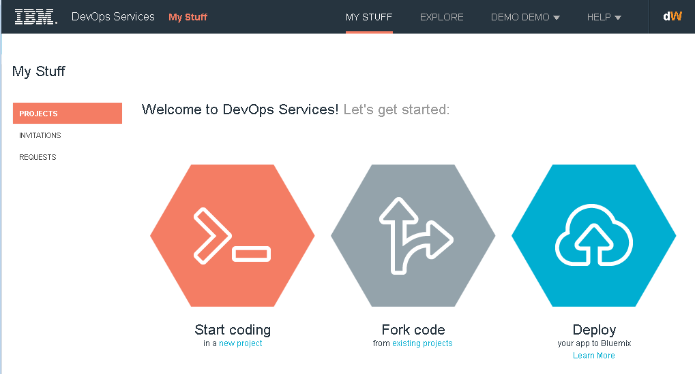

You can see a dialog to create a project. Give the project a name
and click **Connect to an external GitHub repository**.

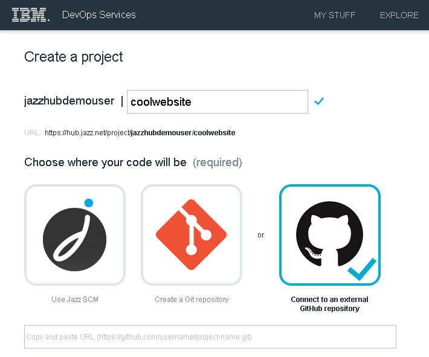

---
##Connect to an external GitHub repository 

A prompt opens where you copy and paste the GitHub URL.
 
Go back to the GitHub browser tab where you created your repository.

In the bottom right of the page look for **HTTPS clone URL**. 
Copy that URL and go back to the DevOps Services browser tab.

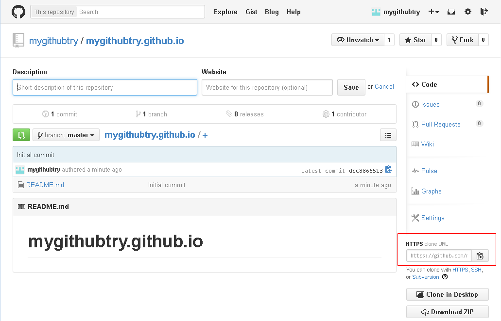

Paste the URL into the prompt in the Create a project page and click **CREATE**.
The overview page for the project opens. 

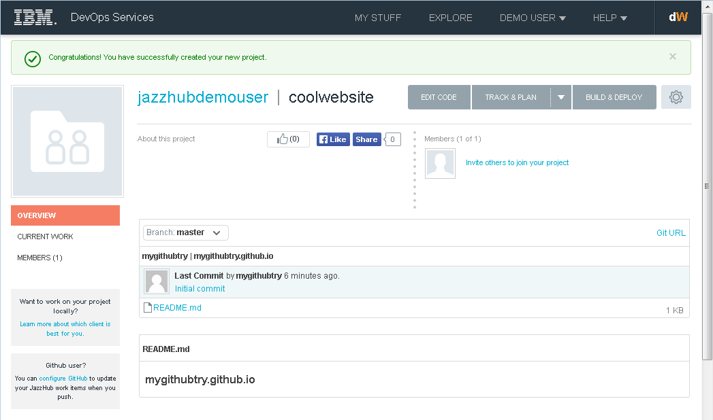

---
##Edit code

Click **EDIT CODE**. Now your in the Web IDE. On the left is a 
working navigation tree for your code. Right-click the root folder, for example,
**jazzhubdemouser | coolwebsite**.

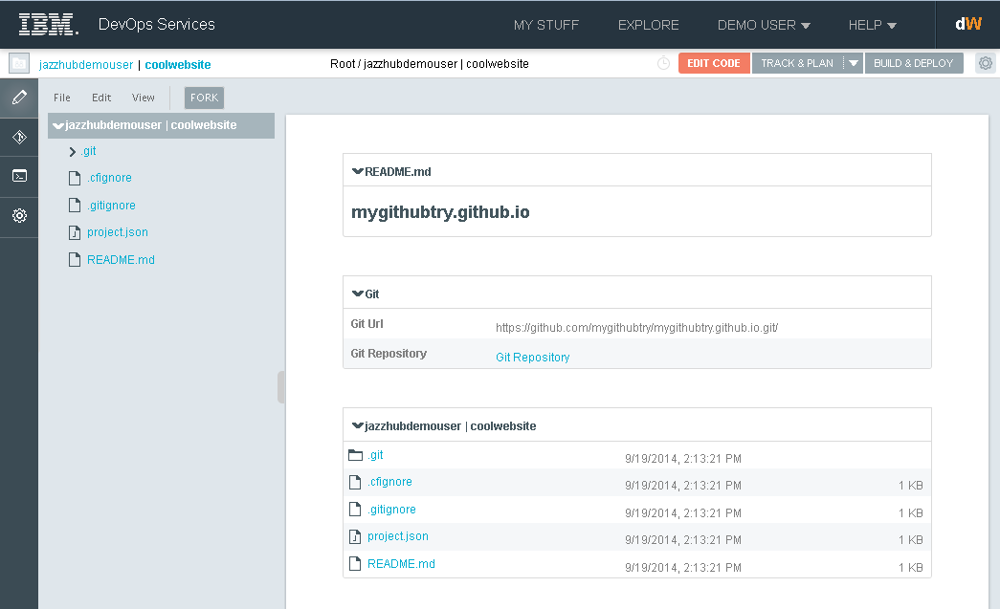

A menu opens with selections to work with files, folders, and projects. 

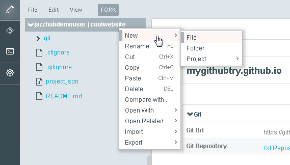

Next, you can create a new file and call it `index.html`.

Start writing some HTML in the editor pane.

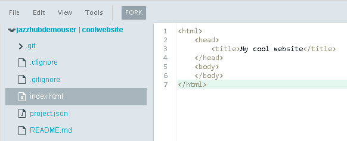

Just write enough HTML to establish a page.
You can add more content later. 

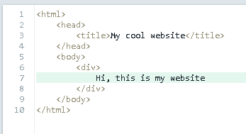

---
## Commit changes to your GitHub repository

Click the Git icon in the left navigation bar to open the Git repository page 
where you can commit a change back to your GitHub repo.

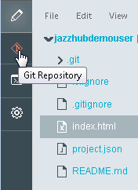

Click the **Select All** check box to select the changed files.

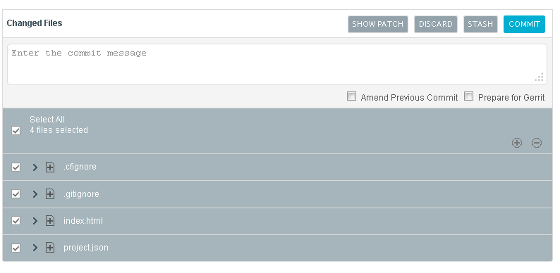

Add a comment for the commit message, then click **COMMIT**.

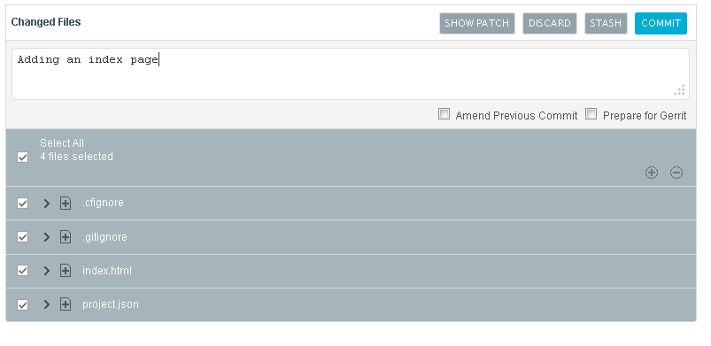

You can see that your change is in the **Commits** section. 
Click **PUSH**. 

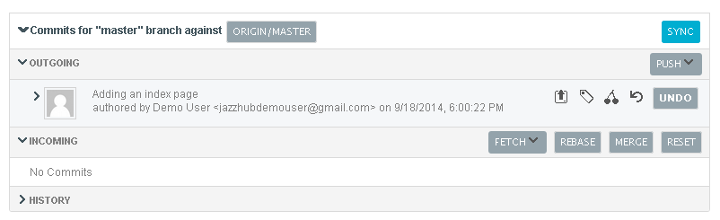

Now you’re prompted for your GitHub credentials. For every change that
you push, you must provide your GitHub credentials.

 

Type your GitHub user name and password, and click **Submit**.
 
The change is pushed to your GitHub repo. 

---
##Check your website 
The first time you create a page, 
it can take up to 10 minutes for the page to start working. 
After that, changes you make to the page are shown right away.
 
If this is the first time you’ve used GitHub, you must verify your GitHub email address. 

You can type `[your username].git` 
into your web browser to go to your new website.

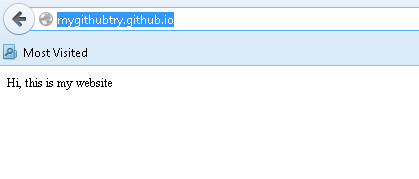 

Wait about 10 minutes to see your website. You can find information about GitHub pages at [pages.github.com](https://pages.github.com/).

---
##Make more changes to your website
Now you can add a css and JavaScript if you like and drag photos 
from your desktop to make your website interesting.

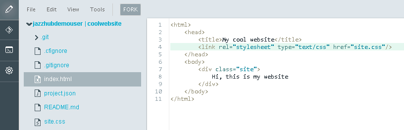 

Now you can add a css with a reference to a `site` css class  that colours 
the division orange, text white, and adds a margin and padding. 

**Tip:** If you right-click `index.html`, you can open it with a web browser to check what 
your page looks like before you commit it again.

Commit this change the same way as before by going to the Git repository, adding a comment, 
committing and pushing. You can see the change right away. 

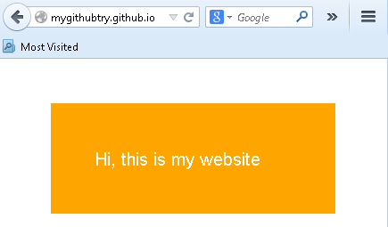

Each commit is recorded. You can build a website by storing new versions of 
the files, so if you make a mistake, you can easily go back and see what changed.

 

For example, you can see the color change from orange to red. 
You can compare changes by clicking **Compare**
for the file in the **Changed Files** section.
From the **Commits** section you can open **HISTORY** to see the changed files.

---
##Summary

You saw how easy it is to build a website with
GitHub pages and DevOps Services. 
You quickly set up accounts and repositories and
pushed your first page to GitHub. You continued to
make changes, commit and push them, seeing  
your updated website right away.

Tell us what you think. What worked well? 
What could be better? Post your comments to the [IBM DevOps Services forum](https://www.ibmdw.net/answers?community=jazzhub) 
or send an [email](mailto:hub%40jazz.net).

---
##Tutorials

To learn more about Bluemix and DevOps Services capabilities, see these tutorials:

* [Getting Started with IBM Bluemix and IBM DevOps Services using node.js](/tutorials/jazzeditor)
* [Getting Started with IBM Bluemix and IBM DevOps Services using Java](/tutorials/jazzeditorjava)
* [Setting up Eclipse, Git, and Rational Team Concert Desktop Clients to access IBM DevOps Services](/tutorials/clients)
* [Developing IBM Bluemix applications in Node.js with the IBM DevOps Services Web IDE](/tutorials/jazzweb)
* [Developing IBM Bluemix applications in Java with Eclipse and IBM DevOps Services](/tutorials/jazzrtc)    
* [Getting Started with tracking and planning using IBM DevOps Services](/tutorials/trackplan)  
    
&copy; Copyright IBM Corporation 2013, 2014.
