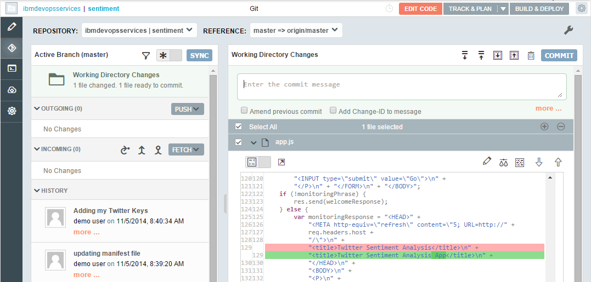
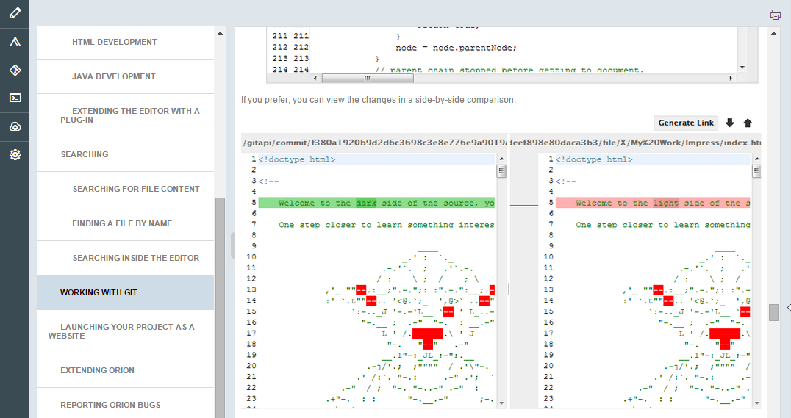
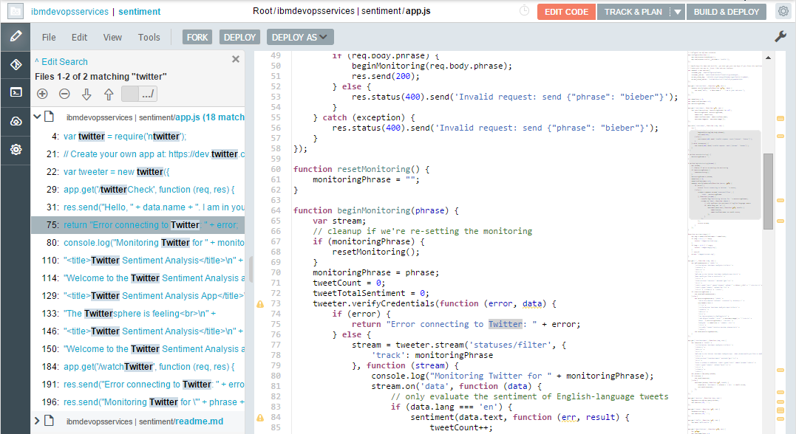

## What's New

### December 10, 2014

In the last few months, we have seen a tremendous amount of positive feedback for the IBM&reg; DevOps Services Track & Plan Beta. Our first priority is to provide you the ability the track your work, monitor your team's activity, and plan your sprints without the tool getting in your way. 

In that spirit, we are pleased to announce that the new Track & Plan feature is now generally available for all DevOps Services projects.

Here is an overview of the changes in Track & Plan:
* Clicking on the **Track & Plan** button will always take you to the new Track & Plan. You don't have to explicitly enable the new Track & Plan anymore.
* The previous version of Track & Plan is still available for a limited period of time. To use the previous version of Track & Plan, click the down arrow on to the **Track & Plan** button and select **Project Dashboard**.
* The Current Work functionality will be retired in favor of the new Track & Plan. Clicking on the **Current Work** tab, or using a bookmark for Current Work, will always take you to the new Track & Plan.

This is a significant milestone for us and we hope you continue to give us feedback.

Here are the details of what's new in Track & Plan:

## Ranking improvements
You can drag and drop items from the **Recently Created** view to the **Ranked List** view to rank them. The rank of the item is now also displayed in the **Sprint Planning** view.
![dragging work item to rank][68]

Additionally, you can click the rank number to edit it instead of dragging and dropping.
![editing rank number][69]

## Work item count
The work item count is now displayed on each view. For views with paged results, the count includes the work items that are not loaded yet. The count is updated as work items are added or removed from the view. Filtering a view also updates the work item count.
![count examples on My Work lanes and backlog][70] 

## Shortcut to set 'planned for' attribute
When you use the Quick Create feature to create a work item, you can now set the planned for attribute by entering "~" as a keyboard shortcut.
![Planned for attribute shortcut][71]

## Grid view is now table view
The new table view displays more work items and additional columns in a more condensed form than the grid view. The table view makes it easier to find information in a long list of work items. 
![New table view][72]

## Sprint Planning
The start and end dates of the sprint now show in the title of each lane in the **Sprint Planning** view.
![Dates in Sprint Planning view][73]

## Task breakdown action now available everywhere
Previously, you could only access the task breakdown action from the **Backlog** or **Sprint Planning** views. Now, you can access the task breakdown action from all views. When you are assigned a story, for example, you can break it down to tasks without ever leaving the **My Work** view.
![task breakdown in My Work view][74]

### November 10, 2014

The IBM DevOps Services web integrated development environment (IDE) has been significantly changed. It has several new user interfaces (UI) and more capabilities.

## Git UI

On the Git UI, you can now access all major Git capabilities in a layout that is like the web IDE editor. On one page, you can view history, sync changes, create commits, and more. For complete details about the updates, see the announcement on the [Orion website](http://planetorion.org/news/2014/10/announcing-orion-7-0/).

##Help system

The help system is now a simple HTML5 and JavaScript page with overview and detail panes.

##A new global search UI

Instead of needing to open the global search page, you can now search directly from the editor. To run a global search, click **Edit -> Global Search**.

##Third-party libraries

 * [ESLint](https://github.com/eslint/eslint) was updated to 0.7.2
 * [Doctrine](https://github.com/Constellation/doctrine) was updated to 0.5.1
 * [CSSLint](https://github.com/CSSLint/csslint) was updated to 0.10.0

##Language tooling

The CSS and JavaScript language tooling is improved in this release.

###Content assist

By using the JavaScript content assist, you can now place proposals inside JSDoc-formatted comments and obtain assistance while adding JSDoc tags and working with parameters, type objects, and RegExp literals. For full details, see the [Orion website](http://planetorion.org/news/2014/10/orion-7-0-language-tooling-enhancements/).

###ESLint support

The web IDE has new linting rules and a few content assist templates and completions that you can use to create ESLint directives.

 * You can detect empty code blocks by using the new no-empty-block rule, which is off by default.
 * The new throw-error rule, ensures that you throw error-objects only from throw statements. 
 * The web IDE no longer uses JSLint or JSHint directives. Instead, warnings are shown when unsupported usage is detected based on a linting rule. 
 * To correct ESLint directives, you can use the new content assist completions.
 * You can use the new ESLint directive templates.
 * You can find assistance to set up an environment and to disable or enable rules.

For full details, see the [Orion website](http://planetorion.org/news/2014/10/orion-7-0-language-tooling-enhancements/).

###Parser improvements

To provide content assist inside JSDoc blocks, the web IDE now recovers unclosed or incomplete comment blocks while parsing your source. The new block comment recovery support parses and recovers all complete statements up to the incomplete comment.

The web IDE also reports parsing errors that cause a complete failure to parse, where no tokens at all are being returned from the parse. For full details, see the [Orion website](http://planetorion.org/news/2014/10/orion-7-0-language-tooling-enhancements/).

###Improved mark occurrences

The web IDE is more accurate and provides more occurrence support.

 * You can show occurrences of labeled statements, throw statements, and things that were not defined in the file.
 * You can mark occurrences in use-before-define and hoisting scenarios. 

For full details, see the [Orion website](http://planetorion.org/news/2014/10/orion-7-0-language-tooling-enhancements/).

##Editor hover help

In the web IDE, if you hover over a function, the rendered documentation for that function is shown. To view an example, see the [Orion website](http://planetorion.org/news/2014/10/orion-7-0-language-tooling-enhancements/).

##Cloud foundry tooling

The web IDE now has a Cloud Foundry manifest editor that highlights syntax, reports on errors and warnings, and provides content assist. In addition, from the deploy window you can launch applications that have missing or incomplete manifests, and persist missing manifest content during deployment. For more details, see the [Orion website](http://planetorion.org/news/2014/10/orion-7-0-language-tooling-enhancements/).

---
### October 24, 2014

## Docs page 

The Docs page contains all of the documentation about IBM&reg; DevOps Services. Think of it as the starting point for learning about DevOps Services and how to integrate with IBM Bluemix&trade;. 

On one page, you can find the tutorials, references, resources listed by topic, and even this "What's New" information. The resources by topic include valuable content from the members of the DevOps Services community.

You can reach the home page from any DevOps Services page by clicking the  **Help** menu.
![Help menu with link to Doc page][67]

The topics pages are regularly updated, so check them often.

### New tutorial

 * Try the new tutorial, [Developing with Git in the IBM DevOps Services web IDE.](/tutorials/gitweb)

### New reference pages 

 * If you use a Git repository for your DevOps Services project, [learn how to configure a local client.](/docs/reference/gitclient/)
 * If you use Jazz source control management for your DevOps Services project, [learn how to configure a local client.](/docs/reference/jazz_scm_client/) 
 * If you use a Git repository for your DevOps Services project, [learn how to do common tasks in the web IDE.](/docs/reference/git/)

### October 2, 2014

## Track & Plan Beta

###Save and share custom views
You can now save customized views and share them with teammates.

After you apply a filter to a view, you can save it.
![filter text and save button][63]

Your custom views appear in the navigation area near the standard views. To share a view with your teammates, click the **Share** icon.
![share custom view with team][61]

You can display only your custom views or both your custom views and your shared custom views.  Click the icon to show and hide the views.
![toggle shared views display][62]

###Quickly see team progress on a sprint
You can now see how much work your team has completed for a sprint.  In the Team's Work and Sprint Planning views, click **Team Progress** to see the time remaining, hours worked, items resolved, and story points achieved on a sprint.
![team progress view showing in-process sprint][56]

###Drag work items to assign child relationships
You can now assign child work items to work items in the backlog. Click a work item and drag it onto the intended parent work item.  Look for the **Add as child** hover text if you're concerned about changing the item's rank.
![drag work items to assign child relationship][59]

###My Activities view

You can use the My Activities view to see important project activity.
 * View work items in which your teammates have mentioned you in My Events.
 * View updates to your subscribed work items in My Subscriptions.

![My Activities showing mentions and updates to subscribed work items][64]

###Create child tasks 

You can now create an item and assign it to a parent from the taskboard.

Click the **Child task breakdown** icon to open the taskboard.

![My Activities showing mentions and updates to subscribed work items][66]

From this view, you can see the parent item and any children. Click in the **Create a child work item** field to create a new item and assign it to the parent work item listed.

![My Activities showing mentions and updates to subscribed work items][65]

###Other improvements

You can now add and remove work item subscribers from the drop-down work item editor.  Click in a work item's title field to view the drop-down menu and either add or remove subscribers.
![add work item subscriber][57]
![remove work item subscriber][58]

Use the new color-coded icons to quickly differentiate between work item priority, severity, and status.
![Sprint Planning view displaying colored icons][60]

---
### September 12, 2014

## Build and Deploy to IBM Bluemix

###Multistage deployment

You can now configure IBM DevOps Services projects to deploy to multiple Bluemix spaces. To use multistage deployment, create more than one deployer stage. For example, you might configure a stage that deploys to a "dev" space for development, and another that deploys to a "production" space. 

![a configured pipeline set-up][55]

### Automatic builds can now be disabled

When you use the Advanced Build & Deploy option, you can disable automatic builds that run when changes are pushed to your project. To disable the automatic builds, clear the **Automatically build when a change is delivered/pushed** check box when you configure a builder.

---
### September 2, 2014
 
## Track & Plan Beta 
 
### Task board view added 
  
Now you can view all of the children of a parent work item at the same time. 
 
Click on the blue arrow on a parent item to open the parent's task board.   
 
>	 
 
From here, you can view all the child items in lanes by status.  
You can see which tasks you need to start to complete the story. 
 
>	 
 
You can drag a work item into another lane to change its status or click **Back to My Work** to return to your original view. 
 
###Track & Plan interface updates 
 
You can now use the All Work view to see all the work items that are associated with your IBM&reg;  
DevOps Services Track & Plan Beta project. Use this view to see both incoming items and items that are assigned to sprints.  
 
>	 
 
Notable UI design changes: 
 * When you change views, you will see only the items in your current sprint. To view another sprint, click **Sprint 1 (Current Sprint)** 
and select the sprint from the list. 
 * The options to create or edit sprints are available only in the Sprint Planning view.

---
### Aug 28, 2014

## General enhancements

### Our BUILD & DEPLOY and TRACK & PLAN features are now Bluemix Add-Ons to provide a better integrated Bluemix experience

The Track & Plan Add-On provides a listing of your IDS projects and their member count, 
visibility, and whether or not the TRACK & PLAN capability is enabled. 
From the Bluemix Add-On, you can quickly and easily create a new work item for any of your listed 
DevOps Services projects or navigate to your planning tools. 

>	

The Delivery Pipeline Add-On provides a listing of your 
DevOps Services projects and the state (SIMPLE, ADVANCED, OFF) of BUILD & DEPLOY use. 
From the Bluemix Add-On, you can quickly check the status of your builds, deployed app, and 
most recent deployments, or easily navigate to your most recent build logs or deployment details.

>	

If your project exceeds free TRACK & PLAN or BUILD & DEPLOY usage, 
you will need to configure these Add-Ons in Bluemix. 
Learn more about [Bluemix pricing](https://hub.jazz.net/learn/cost). 

## Web IDE enhancements

### From Many to One

You can now work with Git from a single page. The current Git page looks like this (with sections collapsed):

>	

Let's take a look at what's in each of these sections. 

### Repo Header

At the very top of the page, there is name of the repo along with buttons that perform repo-level actions:

* **Apply Patch** shows a dialog so you can select the URL or file that contains the patch
* **Pull** performs a pull on the repo (fetch + rebase)
* **Delete** deletes this repo

### Changed Files

This section replaces the Git Status page. Changed Files shows you the current state of your working directory. With no files changed, the section looks like this:

.	

The top of the section contains 2 buttons:

* **Discard** discards any changes made to selected files and reverts the files to their previous committed state.
* **Commit** commits the selected files with the messaged entered in the commit message box.

Next is the commit message box where you type your commit message. Notice the 2 checkboxes. **Amend Previous Commit** toggles to amend the previous commit (the previous message is fetched and displayed in the message box). **Prepare for Gerrit** adds a `ChangeId` to the commit message.

When files are changed, they show in a table under the commit message box:

>	

You can expand the files to reveal the changes made:

>	

You can also view the differences side by side or open a compare editor to view the differences.

You can select the files to include in the commit by using the checkboxes (or the select all checkbox if you want to include all files). As you select files, a number counter at the top of the table changes to match your selected file count.

Once you have selected your files (and typed in a commit message) you can click **Commit** to commit them (or **Discard** to discard the changes made).

When you have files selected, a Show Patch link showns on the same line with the Commit and Discard buttons. This creates a patch for you out of the files that you have selected.

>	

###Commits

The commits section has new sub-sections.

>	

* **Outgoing** lists all of the commits that were not pushed to the remote repo

* **Incoming** lists all of the commits that were not merged into the local repo

* **History** lists all of the commits that the local branch has in common with the remote branch

Let's see what happens, when a change is committed:

>	

The commit shows in the **Outgoing** section. There is a new **Undo** button so you can undo the commit and restore changed files back into your working directory (a soft reset).

Before pushing, you want to be sure that you are caught up to all changes, so you can click **Fetch** in the **Incoming** section to fetch the latest changes. All of the changes that were not merged show and you can accept them by clicking **Rebase** or **Merge**.

>	

The accepted changes now show up in the **History** section. If you have lots of entries you can scroll down to view the the history, or click **More commits for <Branch>** to load more entries.

Once you are all up to date with the remote branch, you can push your changes.

There is also a new button **Sync**, which is a combination of Fetch, Rebase and Push functions.

### Changes in a Commit

Expanding any commit in the history shows the changed files (this is true for any place a commit is shown on the page):

>	

### Branches and Tags

The branches and tags sections were merged into one section as well. There are top level items for local branches, remotes and tags. The 2 buttons in this section are:

* **New Remote** which opens a dialog to add a new remote
* **New Branch** which opens a dialog to create a new branch

>	

If you expand the local item, you can see all of the local branches that you have for the current repo. You can check a branch out from here.

>	

If you expand the branch, you can see the log for that branch along with all the allowable actions next to each commit.

>	

Each remote can be expanded to show all of its remote branches along with applicable actions for each entry.

You can see the log for a remote branch by expanding it.

The tags section follows the same pattern. When you expand the top level item, you are presented with the list of tags along with all the available actions for that tag.

 
### Configuration

The configuration section is now shown as a table.

>	

---
### June 27, 2014

## Build and Deploy to IBM Bluemix

### Simple application deployment to IBM Bluemix for Jazz SCM projects

You can now set up Simple auto-deployment of your IBM&reg; Bluemix&trade; application for
a Jazz&trade; SCM project. 
If you selected the **Deploy to Bluemix** option when 
you created your Jazz SCM project, or choose this option in Project Settings,
you can select the Simple option under Build & Deploy.
When Simple is turned on, any changes delivered to the configured
Jazz SCM stream triggers a push 
of the application to Bluemix.

## General enhancements

### More options when forking a project

When you fork a project from the Web IDE, you can now select if your project is public or private, if
you would like to add features for Scrum
development, and if you would like to deploy your application to Bluemix. The options to make it private 
and deploy to Bluemix can be changed in Project Settings after your project is created.

>	

&copy; Copyright IBM Corporation 2013, 2014.

[1]: /whatsnew/images/quick-planner2.png
[2]: /whatsnew/images/live-markdown-editing.png
[3]: /whatsnew/images/downloadable-binaries.png
[4]: https://jazz.net/blog/index.php/2014/04/15/jazzhub-is-now-ibm-devops-services/
[5]: /whatsnew/images/ibm-ids.png
[6]: https://jazz.net/blog/index.php/2014/02/28/off-and-running-in-2014-announcing-clm-4-0-6/
[7]: https://jazz.net/products/rational-team-concert/whatsnew/
[8]: /whatsnew/images/configure-application-deployment.png
[9]: /whatsnew/images/automatic-build-source-code.png
[10]: /whatsnew/images/automatic-deployment-built-applications.png
[11]: /whatsnew/images/track-changes-deploy.png
[12]: /whatsnew/images/select-builds-deployment.png
[13]: /whatsnew/images/deployment-history.png
[14]: /whatsnew/images/drill-in-bluemix.png
[15]: /whatsnew/images/scope-search.png
[16]: /whatsnew/images/manual-deploy-dialog.png
[17]: /whatsnew/images/deploy-as.png
[18]: /whatsnew/images/additional-syntax-6.png
[19]: /whatsnew/images/html-javascript-linting.png
[20]: /whatsnew/images/validation-settings-page.png
[21]: /whatsnew/images/unscoped-templates.png
[22]: /whatsnew/images/commit-task-git.png
[23]: /whatsnew/images/project-member-tab.png
[24]: /whatsnew/images/private-project-setting.png
[25]: /whatsnew/images/change-owner.png
[26]: /whatsnew/images/SuccessfulProjectCreation.png
[27]: /whatsnew/images/new-project-details.png
[28]: /whatsnew/images/git-hosting.png
[29]: /whatsnew/images/copy-git-url.png
[30]: /whatsnew/images/settings-page.png
[31]: /whatsnew/images/mystuff-gettingstarted.png
[32]: /whatsnew/images/orion-menus.png
[33]: /whatsnew/images/orion-deploy-options.png
[34]: /whatsnew/images/auto-deploy.jpg
[35]: /whatsnew/images/orion-capabilites.png
[36]: /whatsnew/images/accepted-invite-inline.png
[37]: https://jazz.net/blog/index.php/2013/12/06/just-in-time-for-the-new-year-many-reasons-to-celebrate-clm-4-0-5/
[38]: https://jazz.net/products/rational-team-concert/whatsnew/
[39]: https://jazz.net/downloads/rational-team-concert/releases/4.0.5?p=news#jazzhub
[40]: /whatsnew/images/connectfromeclipse.png
[41]: /whatsnew/images/MarkOccurrences.png
[42]: /whatsnew/images/JavaScriptOutlineView.png
[43]: /whatsnew/images/MarkdownViewer.png
[44]: /whatsnew/images/invite-decline.png
[45]: /whatsnew/images/invite-cancel.png
[46]: /whatsnew/images/githubintegration.png
[47]: /whatsnew/images/mystuff.png
[48]: /whatsnew/images/project-rename-before.png
[49]: /whatsnew/images/project-rename-after.png
[50]: /whatsnew/images/readmemd-large.png
[51]: /whatsnew/images/autosaveoptions.png
[52]: /whatsnew/images/richworkitemeditor.png
[53]: https://hub.jazz.net/project/srich/JazzHub
[54]: https://hub.jazz.net/project/srich/JazzHub
[55]: /whatsnew/images/configured-pipeline.png
[56]: /whatsnew/images/teamprogressview.gif
[57]: /whatsnew/images/addsubscriber.gif
[58]: /whatsnew/images/removesubscriber.gif
[59]: /whatsnew/images/dragdropchild.png
[60]: /whatsnew/images/iconcolors.gif
[61]: /whatsnew/images/shareviewwithteam.gif
[62]: /whatsnew/images/showsharedviews.gif
[63]: /whatsnew/images/savecustomview.gif
[64]: /whatsnew/images/myactivities.png
[65]: /whatsnew/images/childtaskboard.png
[66]: /whatsnew/images/childtaskbreakdown.png
[67]: /whatsnew/images/doc_landing_menu.png
[68]: /whatsnew/images/unrankedItems.png
[69]: /whatsnew/images/explicitRanking.png
[70]: /whatsnew/images/count-all.png
[71]: /whatsnew/images/selectSprintQuickCreate.png
[72]: /whatsnew/images/tableView.png
[73]: /whatsnew/images/sprintPlanning.png
[74]: /whatsnew/images/taskBreakdown.png
